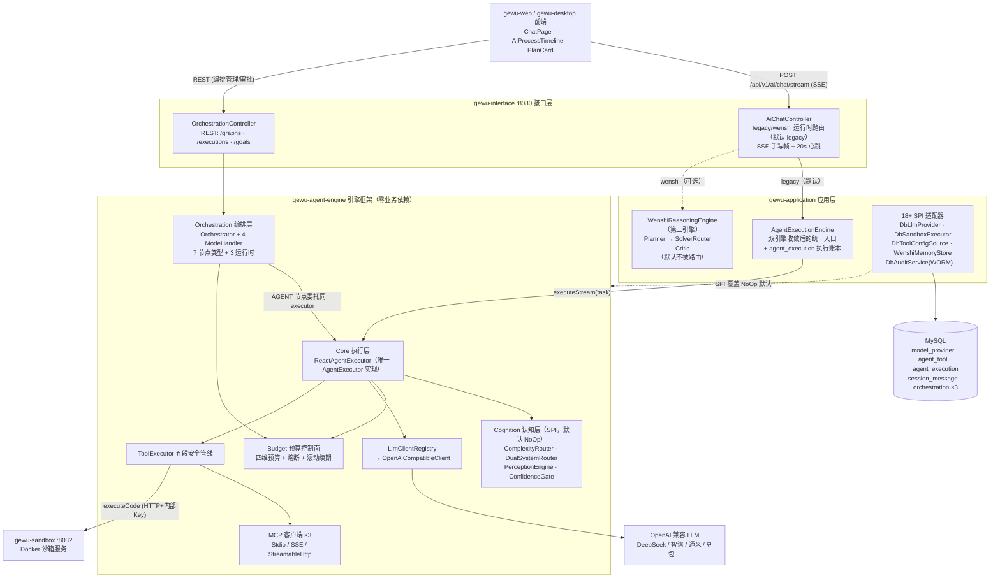
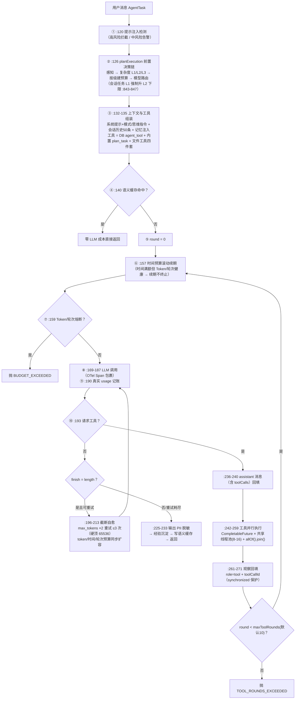
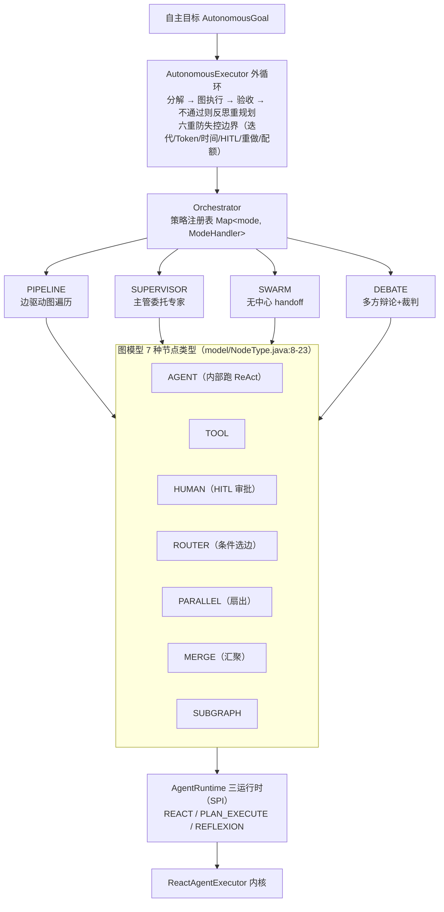
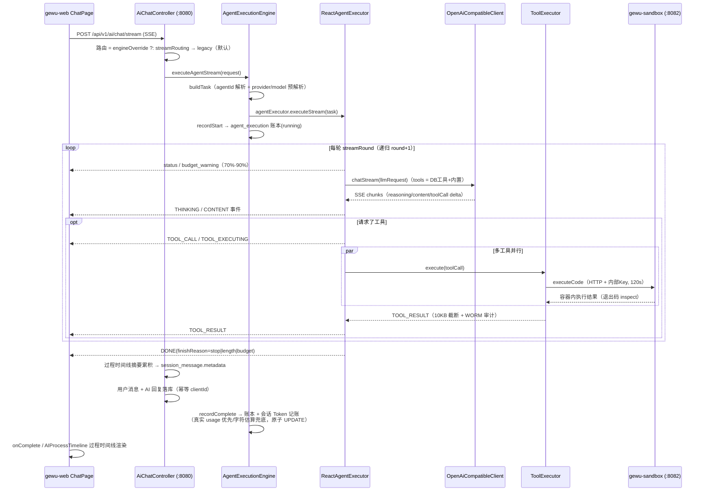
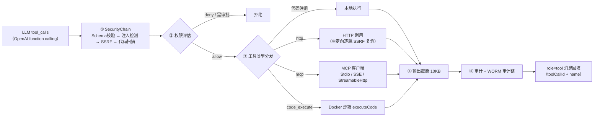
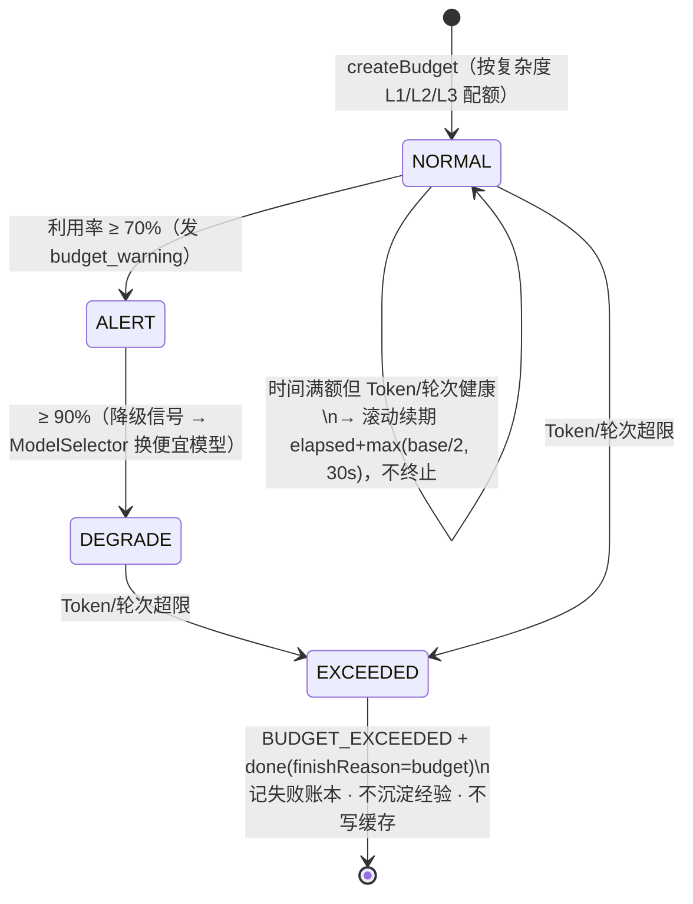

# 格物平台 Agent 智能体引擎设计分析报告

> **分析对象**：gewu-platform（格物平台）智能体引擎——`gewu-agent-engine` 模块及其在宿主应用中的实际接入形态
> **分析方法**：三路独立代码探索交叉验证 + 关键文件人工复核（结论均带 `文件:行号` 锚点；路由默认值、主循环代码、自动装配均经人工亲读确认，置信度 A 级——代码直接证据）
> **设计文档出处**：`docs/agent-engine/`（14 篇框架技术文档）、`docs/design/29-agent-orchestration-engine.md`（AOE 架构设计 v1.0）、`docs/design/28-workflow-engine-design.md`（边界澄清）、`docs/design/41~45`（认知接线与双引擎收敛决策链）
> **日期**：2026-09-17

---

## 一、核心结论（TL;DR）

**Q1：引擎设计思路是哪种？是简单常规的 ReAct 引擎吗？——不是。**

项目自研了一套**"对标 LangGraph / AutoGen、面向 Java + Spring Boot 生态"的多层 Agent 引擎框架**（独立 Maven 模块 `gewu-agent-engine`，约 150 个主源文件，零业务依赖，通过 11+ SPI 与应用层桥接）。设计思想一句话概括：

> **"ReAct 即默认内核，编排即图，认知即 SPI"**

教科书式 ReAct 循环（LLM 推理 → 工具调用 → 观察回填 → 循环）只是这套框架**最内层的执行策略**。在外面还包了四层东西：

1. **图编排层**：自研 DAG 节点图引擎（7 种节点类型 × 4 种多 Agent 协作模式 × 3 种运行时策略）
2. **认知决策层**：感知引擎 → 复杂度路由（L1/L2/L3）→ 双系统路由（System 1/2）→ 模型路由 → 置信度门控（全部为 SPI 插件）
3. **预算控制面**：四维预算（Token/时间/成本/轮次）+ 熔断 + 时间滚动续期 + 降级信号，横切在每轮循环头部
4. **安全管线**：输入注入检测 → 五段工具安全链（Schema/注入/SSRF/代码扫描/权限）→ 输出 PII 脱敏 → WORM 审计

**Q2：现在实际接入并使用的是哪一个引擎逻辑？——`ReactAgentExecutor`（增强版 ReAct 单循环），即代码中所谓的 "legacy" 路由。**

四条硬证据（均经人工验证）：

| # | 证据 | 位置 |
|---|------|------|
| 1 | `gewu.wenshi.routing.chat` / `.stream` 两处 `@Value` 默认值均为 `legacy` | `gewu-interface/.../controller/AiChatController.java:93-97` |
| 2 | yml 显式钉死 `stream: legacy`，注释记录 2026-09-12 终审裁剪："本地基准评测显示 wenshi 引擎质量无增益（-0.4%）且时长 2.4x，生产流式路由回 legacy 引擎" | `gewu-interface/src/main/resources/application.yml:153-157` |
| 3 | `@ConditionalOnMissingBean` 直接 `new ReactAgentExecutor(...)`，全工程唯一 `AgentExecutor` 实现，**无工厂类、无按任务选择逻辑** | `gewu-agent-engine/.../config/AgentEngineAutoConfiguration.java:310-328` |
| 4 | `application-prod.yml` 无任何 `wenshi.routing` 覆盖 → 生产与开发一致走 legacy | 配置核实 |

同时，编排层三种运行时（React/PlanExecute/Reflexion）**零生产调用**（`docs/design/43` D-6 未接线、`docs/design/45` 终审确认观测态）；第二认知引擎 `WenshiReasoningEngine` 已编译进包但默认不被路由。

**分层视角总结**：设计上是"ReAct 循环为内核、编排框架为躯干、认知/预算/安全子系统为器官"的自研多智能体引擎框架——既不是简单 ReAct，也不是 LangGraph 的 Java 移植（图为完全自研模型）。生产运行的是其中"增强版 ReAct 单循环"这一条路径；编排/多 Agent/认知层处于"实现完整、有意识未接线"状态，这是 43/44/45 号决策文档驱动的基准评测收敛结果（详见 §十）。

---

## 二、设计思路与设计原则（文档证据）

引擎的设计基因来自 `docs/agent-engine/README.md` 与 `docs/design/29-agent-orchestration-engine.md`（AOE 架构设计 v1.0）：

| 设计原则 | 内容 | 出处 |
|---|---|---|
| 生态定位 | "对标行业内的 LangGraph / AutoGen，但面向 Java + Spring Boot 生态" | `docs/agent-engine/README.md:11` |
| 原则三 | **"ReAct 即默认，工具可并行"**——AGENT 节点内部跑 ReAct 循环，同轮多个工具调用并行执行 | `docs/agent-engine/01-overview.md:33` |
| 原则四 | **"编排即图，图与 ReAct 统一"**——"工作流引擎的 DAG 变为编排图的一种特例，Agent 引擎的 ReAct 循环变为 AgentNode 内部的执行策略，双轨统一为单轨"，消除"工作流编排"与"Agent 循环"双轨 | `docs/design/29:127-143`、`README.md:127` |
| AOE 五大能力场景 | SDLC 全生命周期 / HITL 人工审批 / 自主目标执行 / 多 Agent 协作模式 / 自我进化 | `docs/design/29:15-23` |
| 两轨边界 | 工作流引擎（人工审批流，7 表）与编排引擎（Agent DAG 自主执行，4 表）**并存不合并** | `docs/design/28`（V1.2 边界澄清） |

这套设计的技术选型含义：

- **单体内分层**：引擎框架自身不含任何业务依赖（仅 Spring Boot + Reactor + Jackson + Lombok），业务能力（DB 工具、LLM 密钥、沙箱、记忆、审计）全部通过 SPI 注入，宿主 `gewu-application` 用 18+ 适配器覆盖引擎的 NoOp 默认实现——框架可独立开源复用；
- **Reactor 流式**：流式输出基于 Reactor `Flux`，但 SSE 写帧在 Controller 层退回 `StreamingResponseBody` 手写（因 Spring MVC 的 ReactiveTypeHandler 会缓冲整个 Flux，破坏实时性，`AiChatController.java:113-120` 注释）；
- **无每会话线程**：执行器无状态，会话隔离靠每次调用的上下文对象（`ToolContext` 携带 sessionId/agentId）+ 共享工具线程池（8-16 线程、队列 100、CallerRunsPolicy）+ `synchronized` 保护消息列表并发回填——**没有虚拟线程**，并发模型是 Reactor + CompletableFuture。

---

## 三、引擎分层架构



各层职责与关键类：

| 层 | 关键类 | 职责 |
|---|---|---|
| Core 执行 | `ReactAgentExecutor` implements `AgentExecutor`（`core/AgentExecutor.java:14`，`execute`/`executeStream` 双入口）；`AgentEngine` 纯门面（`core/AgentEngine.java:25`） | 增强版 ReAct 循环（§四） |
| 编排 | `OrchestrationEngine` 门面（`orchestration/OrchestrationEngine.java:38`）、`Orchestrator` 策略注册表（`Orchestrator.java:40`）、`AutonomousExecutor` 自主目标外循环、`ExecutionControl` 暂停/取消/断点 | 图模型调度（§五） |
| 认知 | `cognition/` 下 `PerceptionEngine`/`ComplexityRouter`/`DualSystemRouter`/`ConfidenceGate` 等 SPI | 执行前置决策链（§4.3） |
| 预算 | `budget/BudgetController`、`BudgetContext`、`BudgetStatus` | 四维预算控制面（§八） |
| LLM | `llm/OpenAiCompatibleClient`、`LlmClientRegistry` | OpenAI 兼容协议、SSE 流式、看门狗 |
| 工具 | `tool/ToolExecutor`、`tool/security/SecurityChain` | 五段安全管线 + 四通道分发（§七） |
| MCP | `mcp/StdioMcpClient`、`SseMcpClient`、`StreamableHttpClient` | 三种传输协议的 MCP 客户端 |

---

## 四、核心执行引擎技术原理（ReactAgentExecutor，生产在用）

类自述（`core/ReactAgentExecutor.java:50-52`）：**"核心循环：LLM 推理 → 若请求工具则并行执行 → 将结果回灌 → 继续推理，直到 LLM 不再请求工具或达到轮次上限"**。单类 1100+ 行，是整个框架唯一被生产使用的执行器。

### 4.1 同步主循环逐步分解（`ReactAgentExecutor.java:118-275`，人工亲读验证）



相对教科书 ReAct 的增强点（全部在同一循环内生效）：

| 增强点 | 机制 | 位置 |
|---|---|---|
| 工具并行 | 同轮多个 toolCall 经 `CompletableFuture.supplyAsync` 并行 | `:242-259` |
| 截断自愈 | `finish_reason=length` 时 max_tokens 翻倍重试（≤3 次，硬顶 65536），**预算同步扩容**（token×2 / time≥elapsed×3 / maxRounds+1），避免重试在循环头被熔断 | `:196-224` |
| 语义缓存 | 高相似历史请求直接回放，零 LLM 成本；截断的部分内容不入缓存 | `:139-146, 230` |
| 内置工具 | `plan_task`（模型自主维护任务清单，发 plan_created/plan_updated 事件）+ 文件工具 read/write/edit/list（经 `FileWorkspaceSpi` 路由到会话沙箱工作区） | `:639-744, 922-957` |
| 输入/输出安全 | 入口注入检测、出口 PII 脱敏后才持久化/缓存/返回 | `:120, 226` |
| 经验沉淀 | 成功运行写入记忆（Wenshi 记忆库适配），供后续注入 | `:1050-1068` |

### 4.2 流式路径（递归实现）

`executeStream()`（`:280-353`）→ 递归方法 `streamRound()`（`:355-603`）：

- **轮首预算事件**（`:368-408`）：70%/90% 阈值 `budget_warning`；熔断后**补发 `done(finishReason=budget)`** 保证前端生命周期完整（熔断误杀修复）；
- **SSE chunk 解析**（`:436-461`）：`reasoning_content` → THINKING 事件、`delta` → CONTENT 事件、toolCall delta 经增量累积器 `accumulateToolCall`（`:1001-1023`）按 id/顺序重组；
- **截断重试特殊事件**：先发 `CONTENT_RESET` 清空前端已流出的半截正文再整体重生成（`:494-527`）；
- **工具执行**（`:576-594`）：TOOL_CALL/TOOL_EXECUTING 事件 → 并行执行 → TOOL_RESULT；
- **下一轮递归**（`:595-597`）：`streamRound(..., round + 1, ...)`；
- **流式 Token 记账**（`:470-480`）：按字符/3 估算消耗（CJK 近似），同步路径才用真实 usage。

事件协议 30+ 种常量定义于 `core/event/AgentEvent.java:93-160`（status/thinking/content/tool_call/tool_executing/tool_result/done/error/content_reset/plan_*/budget_*/confidence_check/verification_result/reflection/experience_saved + 编排层 graph_*/node_*/handoff/approval_*/execution_* 等）。

### 4.3 前置决策链（`planExecution`，`:833-853`）

同步与流式两路共用的"执行前决策管道"：

```
感知引擎（PerceptionEngine，意图识别）
  → 复杂度路由（ComplexityRouter → L1/L2/L3，规则+特征）
  → 预算创建（BudgetController.createBudget 按级配额）
  → 模型路由（ModelSelector，剩余预算作为选择输入）
```

> 注意：模型路由（D-6 相关）当前**未配置不生效**（`gewu.llm.routing.models` 未配置，`docs/design/45` 结论 1）；复杂度路由的预算分级是真实生效的（L1 = token/5 + 30s + 3 轮，L3 = ×3/×4/×2，`BudgetController.java:66-92`）。

---

## 五、编排引擎设计（实现完整，主链路未经过）

编排层是框架中与 ReAct 内核平行的**图执行子系统**——设计意图是让"工作流 DAG"成为编排图的特例、"ReAct 循环"成为 AGENT 节点内部的执行策略（§二 原则四）。



关键实现（均存在但生产主链路不经过）：

- **PIPELINE**（`mode/PipelineModeHandler.java:34-46, 158-186, 251-294`）：边驱动图遍历——从无入边节点起步、ROUTER 条件选边、PARALLEL 并发扇出（activePaths 计数）、MERGE 汇聚等待（mergeArrived 计数）、协作式暂停/取消信号、断点续跑（`__resumeFromNode` 变量 + `ExecutionControl.Checkpoint`，检查点为**内存态**，进程重启即失）；
- **SUPERVISOR**（`mode/SupervisorModeHandler.java:62-149`）：Supervisor 节点用 `AgentMessage` 标准信封（TASK_DELEGATE/TASK_RESULT）委托专家 Agent 并回收结果；
- **SWARM**（`mode/SwarmModeHandler.java:88-184`）：无中心协作——Agent 输出中嵌 `HANDOFF:target|reason` / `FINISH` 指令，`HandoffParser.java:22-26` 正则解析；handoff 链 + 传递深度上限（默认 8）防环；
- **DEBATE**（`mode/DebateModeHandler.java:36-163`）：多方并行辩论 + 裁判 Agent 节点裁决；
- **PLAN_EXECUTE 运行时**（`runtime/PlanExecuteRuntime.java:28-49`）：真 Plan-and-Execute——GoalPlanner 产出计划图 → `ExecutionGraph.fromPlanGraph` 映射执行图 → Kahn 拓扑排序 → 逐步骤委托 ReAct，前置产出注入后续上下文（截断 2000 字符）；
- **REFLEXION 运行时**（`runtime/ReflexionRuntime.java:36-42`）：**简化透传壳**——直接委托 executor，无真实 Critic→reflect→重试循环（`docs/design/43` D-5：完整闭环留待认知 SPI）；
- **自主目标外循环**（`orchestration/AutonomousExecutor.java:61-176`）：分解→执行→**验收（`DualLoopVerifier` 内环 Critic ≤5 轮 + 收益递减检测，外环 LLM 仲裁 ≤2 轮；`ConfidenceGate` 四级置信度门控：≥0.85 采纳 / ≥0.6 换模型 / ≥0.4 换上下文 / <0.4 升级人工）**→不通过反思重规划（发 reflection 事件）；入口 `AntiRunawayGuard.check` 六重防失控边界（`:47-89`）；
- **SDLC 角色注册表**（`orchestration/role/RoleRegistry.java:60-140`）：12 内置角色（需求PM/架构师/开发/重构/代码审查/安全审计/测试/QA 等）= 系统提示词模板 + 能力卡 + 工具集 + 记忆域 + 执行模式；
- **图执行后处理**（`Orchestrator.java:129-259`）：节点输出契约校验（outputSchema 不达标标 FAILED 供上层重试）+ 多 Agent 产出冲突解决（权威优先/多数表决/LLM 仲裁/人工裁决）。

**生产可达性**：编排层仅通过 `OrchestrationController` REST（`/api/v1/orchestration/*`：图的 CRUD/激活、执行与 SSE 流、断点恢复、自主目标）与 `FourPhasePipeline` 到达；**AI 对话主链路（`/api/v1/ai/chat/stream`）不经过编排层**。三运行时在生产代码中零调用，`GraphNode.executionMode` 字段无消费方。

---

## 六、生产实际调用链（端到端，实际生效路径）



**前端消费链**（`gewu-web`）：

- 发送：`ChatPage.tsx:598` `chatStream({message, model, agentMode, thinkingStyle, sessionId, agentId})` → `lib/chat.ts:221-243` `fetch` POST + `Accept: text/event-stream`（跳过 Next.js 代理直连后端）；
- 解析：`consumeChatSse()`（`lib/chat.ts:277-399`）逐行解析 `data:` 帧，60s 空闲看门狗（配合后端 20s ping 心跳），`[DONE]`/`done`/`error` 终态；
- 事件分发：`handleStreamEvent()`（`:404-500`）处理 `content_reset` / `tool_call`·`tool_executing`·`tool_result` / `budget_exceeded`（琥珀横幅）/ `budget_warning`（toast）/ `plan_created`·`plan_updated`（PlanCard）/ `file`；
- 过程时间线：`AIProcessTimeline.tsx` 实时渲染（工具名→中文动词行），历史消息从 `metadata.process` 还原折叠态（最近一次提交 d5e72c7 的"过程时间线持久化"）。

**第二引擎 WenshiReasoningEngine**（`gewu-application/.../wenshi/reasoning/WenshiReasoningEngine.java:56`）：三层认知编排 Planner（任务分解）→ SolverRouter（策略选择）→ Critic（结果验证）+ 经验复用路由 + 推理轨迹持久化（PG）。不实现 `AgentExecutor` SPI，是平行的第二条对话引擎链路；切换开关为 `gewu.wenshi.routing.chat/stream` 配置或请求级 `ChatRequest.engineOverride`（基准评测用，`AiChatController.java:134-161`）。

---

## 七、工具执行管线与沙箱

### 7.1 五段安全管线（`tool/ToolExecutor.java:36-64, 80-144`）



工具层**无通用重试**（重试只存在于 LLM 截断自愈层）；工具级超时 30s（`ToolContext.timeout`），HTTP 请求级 + 重定向上限逐跳复验；LLM 连接 30s / 请求 120s / 流式空闲看门狗 180s（`llm/OpenAiCompatibleClient.java:38-43, 233-249`，SSE 无数据即中断防上游挂死）。

### 7.2 沙箱（gewu-sandbox，独立服务 :8082，Docker 实现）

- **容器安全加固**（`provider/DockerSandboxProvider.java:73-99`）：`no-new-privileges`、cap-drop ALL、只读根文件系统、tmpfs（rw,noexec,nosuid）、默认 `network=none`、CPU/内存限额；
- **命令执行**（`:155-205`）：危险命令黑名单校验（`CommandValidator`，dev 沙箱宽松版）→ docker exec + 超时等待 → inspect 真实退出码；
- **文件读写**：`ContainerFileService`（docker cp tar 流，工作区 `/workspace`）；
- **生命周期**：`executeCode` = 临时沙箱 create → exec → finally 销毁；调度器空闲 30 分钟自动停、**agent 沙箱最长 300s 强制销毁**；
- **引擎桥接**：`DbSandboxExecutorAdapter` → `SandboxClient`（HTTP + 内部 API key + 120s 超时）；文件工具后端 `SessionFileWorkspaceService` 实现 `FileWorkspaceSpi`，路由到会话绑定 dev 沙箱（惰性创建）并记录 before 快照做 diff 变更追踪；
- **Firecracker microVM**：仅存在枚举值（`SandboxRuntime.java:8`）+ 设计文档（`docs/design/27:161-173`）+ 根目录待用二进制包，**无 Java 实现**——唯一 provider 是 Docker。

### 7.3 LLM 接入

`OpenAiCompatibleClient`（`llm/OpenAiCompatibleClient.java:30`）：OpenAI Chat Completions 兼容协议（类注释点名 DeepSeek、智谱、豆包、LongCat、通义千问等国产模型），支持 `reasoning_content` 分离、function calling 增量累积。供应商配置从 `model_provider` 表读取 baseUrl + **SM4 解密 apiKey**（`DbLlmProviderAdapter.java:34-50`，密钥 `gewu.crypto.api-key-secret`）。

---

## 八、预算与可靠性控制面

### 8.1 预算体系（最近三次提交 530b159 / ec33b0a / d5e72c7 的核心改造对象）



- **挂载点**：每轮循环头（同步 `:157/:159`，流式 `:369-408`）——顺序固定为"先续期、后熔断"；
- **熔断范围**：**仅 Token/轮次 BLOCK**，时间维度降为告警（S9 方案A 重构，`BudgetController.java:106-128`）；
- **滚动续期**（`renewTimeBudget`，`BudgetController.java:136-148`）：时间满额但 Token/轮次健康 → 续 `elapsed + max(base/2, 30s)` 并发 `budget_warning`，不终止——解决"熔断误杀长推理会话任务"；
- **截断自愈主动升预算**：`token×2 / time≥elapsed×3 / maxRounds+1`（`:204-210, 508-511`），否则重试轮次会在循环头被熔断（尤其 L1 级仅 30s 时间预算）；
- **记账**：同步路径用 LLM 返回的真实 usage（`:190-191`）；流式路径按字符/3 估算（`:470-480`）；会话级 Token 记账走 `AgentExecutionEngine.recordComplete → CostAccountingService`（真实 usage 优先/估算兜底，原子 UPDATE session 表 tokens/cost）；
- **多 Agent 协作预算预检**（`checkCollaborationBudget`，`BudgetController.java:172-178`）与自主循环入口 `AntiRunawayGuard` 六重边界。

### 8.2 其他可靠性机制

| 机制 | 实现 | 限制 |
|---|---|---|
| 断点续跑 | `ExecutionControl.Checkpoint`（graph+context+resumeFromNodeId）+ `__resumeFromNode` 变量跳过已完成节点；DB 侧 `OrchestrationService` 持久化 graphSnapshot/variables/currentNodeId | **检查点纯内存，进程重启即丢**，无自动重建 |
| 取消（用户中断） | SSE 客户端断连 → 置位 clientGone + dispose() 释放上游；编排层协作式取消信号 | — |
| 幂等 | 会话消息 clientId 幂等；暂停/取消信号幂等；Docker start 304/volume 创建幂等 | — |
| 心跳/死锁检测 | `AgentLifecycleManager` 心跳 60s / 全局 300s 超时 + DFS 等待环检测，推送 agent_timeout/agent_deadlock | — |
| 上下文管理 | 历史消息条数上限 50 + 各处字符截断（工具输出 10KB、文件读取 10KB/目录 4KB、经验 500/1000 字符） | **无 token 级窗口压缩/历史摘要**——token 控制走预算记账（消耗侧）而非上下文裁剪侧 |

---

## 九、持久化与状态模型

| 数据 | 表 | 状态字段 | 写入方 |
|---|---|---|---|
| AI 消息 + 过程时间线 | `session_message`（metadata.process：thinking 段起止毫秒、工具 s/e 时间戳 + 200 字符截断参数/结果，≤100 条） | — | `SessionContextService.appendChatInteraction`（`AiChatController.java:163-237` 累积） |
| 执行账本 | `agent_execution` | `running → completed / failed`（String，无 enum） | `AgentExecutionService`，由 `AgentExecutionEngine.recordStart/Complete/Fail` 驱动 |
| 工具配置 | `agent_tool`（含 requestSchema JSON Schema） | — | 管理端 |
| LLM 供应商/单价 | `model_provider`（SM4 加密 key）、`model_config` | — | 管理端；`CostAccountingService` 计费 |
| 工具调用审计 | 审计日志表 + WORM 审计链 | — | `DbAuditServiceAdapter` |
| 记忆/经验 | Wenshi PG（`wenshi_episodic_event` 等） | — | `WenshiMemoryStoreAdapter` |
| 编排图 | `orchestration_graph` | `draft → active` | `OrchestrationService` |
| 编排执行 | `orchestration_execution` | `PENDING/RUNNING/PAUSED/SUCCEEDED/FAILED/CANCELLED`（状态流转 if 校验：仅 RUNNING 可暂停、仅 PAUSED 可恢复） | `OrchestrationService` |
| 节点级账本 | `orchestration_node_execution` | PENDING/RUNNING/COMPLETED/FAILED/SKIPPED | **仅有实体与 Mapper，无生产写入（未接线）** |
| HITL 审批 | `approval_request` | pending | `DbHitlGatewayAdapter`（HUMAN 节点 + SSE 通知 + Mono Sink 阻塞恢复） |

引擎内部执行态（`AgentTask`、`BudgetContext`、消息列表）为内存态；工作流引擎（`workflow` 7 表，人工审批流）与编排引擎（4 表）按 28 号文档"两轨保留"边界并存。

---

## 十、已实现 vs 实际接线对照表

| 能力 | 实现状态 | 生产在用 | 证据 |
|---|---|---|---|
| ReAct 主循环（同步 for + 流式递归） | ✅ 完整 | ✅ **唯一在用** | `ReactAgentExecutor.java:118/:355` |
| 工具并行 + 五段安全管线 | ✅ | ✅ | `:242-259` / `ToolExecutor.java:80` |
| 四维预算 + 滚动续期 + 熔断 | ✅ | ✅ | `BudgetController.java:113-155` |
| 截断自愈（max_tokens×2 + 预算扩容） | ✅ | ✅ | `:196-224 / :494-527` |
| 语义缓存 / 记忆 / 经验沉淀 | ✅ | ✅ | `:139-146 / :1050` |
| 过程时间线持久化 + 前端回放 | ✅ | ✅ | `AiChatController.java:163-237` |
| 编排图引擎（4 模式 / 7 节点 / 暂停恢复） | ✅ | ⚠️ 仅 REST 可达（`/api/v1/orchestration/*`），**对话主链路不经过** | `OrchestrationController` |
| PlanExecuteRuntime（真 Plan-and-Execute） | ✅ | ❌ 零生产调用 | `docs/design/45` |
| ReflexionRuntime | ⚠️ 透传壳 | ❌ | `ReflexionRuntime.java:40-41` |
| 复杂度路由（预算分级） | ✅ | ✅ | `planExecution:833-853` |
| 模型路由（ModelSelector） | ✅ 代码存在 | ⚠️ 未配置不生效 | `docs/design/45` 结论 1 |
| WenshiReasoningEngine（第二引擎） | ✅ | ❌ 默认 legacy，可 engineOverride | `application.yml:153-157` |
| Firecracker microVM 沙箱 | ❌ 仅设计文档 + tgz 包 | ❌ | 唯一 provider 是 Docker |
| 节点级执行账本 | ⚠️ 有表无写入 | ❌ | `orchestration_node_execution` |
| 跨进程检查点重建 | ❌ | — | `ExecutionControl.java:13-16` 注释自认 |

**未接线是"有意识的技术决策"而非烂尾**：43 号决策备忘录（认知层接线/裁剪）→ 44 号（双引擎收敛门延后）→ 45 号（120 次基准评测终审）形成完整决策链——wenshi 引擎质量无增益（-0.4%）且时长 2.4x 裁剪回 legacy、模型路由未配置暂不接线、D-5 维持简化、D-6 观测态，并预承诺复评规则（"Δ质量 ≥+5% 且 Δ成本 ≤+20% → D-6 接线：System2 → PLAN_EXECUTE 运行时"，接线点已定位在 `planExecution` 产出 `systemChoice.runtimeMode` 之后按 runtimeMode 分派）。

---

## 十一、结构性观察（供后续演进参考）

1. **内核过重**：`ReactAgentExecutor` 1100+ 行承载了循环、预算、缓存、内置工具、安全、经验沉淀六类职责，编排层反而更薄——增强点全部内嵌在单循环里而非分层组合；
2. **编排层"可接线未接线"**：三运行时、`GraphNode.executionMode`、`orchestration_node_execution` 表均为预埋件；若接线 D-6，主链路将首次从"单循环"变为"循环+图"混合形态；
3. **检查点不落盘**：编排暂停恢复依赖内存注册表，进程重启后只能靠外部重放，`OrchestrationService.resumeExecution` 无检查点时仅翻 DB 状态；
4. **无 token 级上下文压缩**：长会话治理依赖消息条数上限（50）与各处字符截断，token 控制全部走预算记账（消耗侧）；
5. **状态字段无 enum**：所有持久化状态为 String，流转校验靠 if 字符串比较（如 `OrchestrationService.java:305/:323`）。

---

## 附：核心文件索引

| 关注点 | 文件 |
|---|---|
| ReAct 主循环（同步/流式） | `gewu-agent-engine/src/main/java/com/gewu/agent/engine/core/ReactAgentExecutor.java` |
| 执行器 SPI / 门面 | `.../core/AgentExecutor.java` · `.../core/AgentEngine.java` |
| 事件协议（30+ 常量） | `.../core/event/AgentEvent.java` |
| 自动装配（唯一实现） | `.../config/AgentEngineAutoConfiguration.java:310-328` |
| 编排门面/调度器/模式 | `.../orchestration/OrchestrationEngine.java` · `Orchestrator.java` · `mode/PipelineModeHandler.java` 等 |
| 三运行时 | `.../orchestration/runtime/{ReactRuntime, PlanExecuteRuntime, ReflexionRuntime}.java` |
| 自主目标 + 防失控 | `.../orchestration/AutonomousExecutor.java` · `.../budget/AntiRunawayGuard.java` |
| 预算控制面 | `.../budget/BudgetController.java` · `BudgetContext.java` |
| 工具安全管线 | `.../tool/ToolExecutor.java` · `.../tool/security/SecurityChain.java` |
| LLM 客户端 | `.../llm/OpenAiCompatibleClient.java` · `LlmClientRegistry.java` |
| 运行时路由（legacy/wenshi） | `gewu-interface/.../controller/AiChatController.java:93-161` |
| 统一入口 + 账本 | `gewu-application/.../agent/AgentExecutionEngine.java` |
| 第二引擎 | `gewu-application/.../wenshi/reasoning/WenshiReasoningEngine.java` |
| SPI 适配器群 | `gewu-application/.../agent/adapter/`（18+） |
| 沙箱 | `gewu-sandbox/.../provider/DockerSandboxProvider.java` · `service/{SandboxService,ContainerFileService}.java` |
| 前端流式消费 | `gewu-web/src/lib/chat.ts:221-500` · `src/components/pages/AIProcessTimeline.tsx` |
| 框架技术文档 | `docs/agent-engine/`（14 篇） |
| 架构决策链 | `docs/design/28 / 29 / 41 / 43 / 44 / 45` |

---

## 十二、主流引擎内核对比（市场参照系）

> 核实来源：LangGraph 新站文档、AutoGen Teams 文档、Microsoft Agent Framework 概览（2026-08 更新）、OpenAI Agents SDK、OpenCode Agents 页（均对照官方原文）。

**市场内核分四大流派，主流引擎并不都以 ReAct 为主循环**：教科书式 ReAct（文本解析 Thought/Action/Observation）已被淘汰，其现代后裔——"原生 function calling 工具循环"——是编码类 Agent 与 OpenAI Agents SDK 的内核；LangGraph 内核是图状态机，AutoGen 内核是消息传递。

| 内核流派 | 内核抽象 | 代表引擎 | ReAct 在其中的位置 |
|---|---|---|---|
| 工具调用循环（harness 派） | 单主循环 + 固定工具集 + 权限/审批/压缩 | ZCode、Claude Code、OpenCode、OpenAI Agents SDK、Agent Framework 的 Harness Agent | 即内核本身（现代形态） |
| 图状态机派 | StateGraph 节点/边/共享 state + checkpointer | LangGraph、LlamaIndex Workflows、Dify/Coze 节点流 | 预置图/一种拓扑 |
| 消息传递派 | Agent 间消息往返 + 编排器 | AutoGen（RoundRobin/Selector/MagenticOne/Swarm）、CrewAI | Agent 内层局部行为 |
| 外循环规划派 | 计划-执行-验收-重规划外循环 | BabyAGI、Magentic-One Orchestrator、Manus、本项目 AutonomousExecutor | 内循环仍交给工具循环 |

四条市场趋势：① ReAct 被拆解而非废弃（Reasoning 进模型、Act 统一 function calling、Observe 即 tool result 回填）；② 内核抽象两极分化（底层编排原语 vs 顶层 harness，Microsoft Agent Framework 同时押注两极——其 Harness Agent 定义"planning/todo + context compaction + tool approval + memory + observability"正是编码 Agent 派内核外围能力）；③ 可靠性收敛点是持久化检查点 + HITL interrupt（本项目编排层检查点内存态是主要差距）；④ 多 Agent 编排三模式全市场趋同（handoff/orchestrator/graph workflow ↔ 本项目 Swarm/SUPERVISOR/PIPELINE 一一对应）。

**映射结论**：gewu-agent-engine = LangGraph 式图编排层（自研）+ OpenAI SDK 式 ReAct 工具循环内核 + AutoGen 式多 Agent 模式集 + Harness 派预算/审批/时间线外围；生产运行的 ReactAgentExecutor 路径与编码 Agent 主流内核同构。实质差距在持久化检查点与 token 级上下文压缩（见 §十一）。

## 十三、能力补齐实施记录（2026-09，路线 A/B）

针对 §十一 提出的"主 Agent 派生多子 Agent 并行 → 汇总 → 再规划 → 实施"缺口，完成双路线实施：

### 13.1 路线 A：`spawn_subagents` 内置工具（主链路 agent-as-tool，对齐主流）

- **语义**：主 Agent 在 ReAct 循环中调用 `spawn_subagents({agents:[{name,agentId?,prompt}]})`，动态派生 N 个独立 ReAct 会话（独立 messages/预算/ToolContext）经专用线程池并行执行，聚合结果回灌主循环——主 Agent 运行时自主决定派几个、派谁（补齐"动态派生"语义核心）。
- **实现**：`ReactAgentExecutor`（常量/注册/同步+流式分发/`executeSpawnAgentsSync|Stream`/聚合）、`AgentTask.agentDepth`（深度护栏：`depth >= maxDepth` 不再注册派生工具，天然防递归）、`ToolContext` 携带深度/父已解析模型/配额继承、`AgentEngineConfig.subAgentExecutor`（独立线程池防嵌套 join 死锁，CallerRuns 背压降级）、`AgentEngineProperties.engine.subagents.*`（enabled/maxPerSpawn=5/maxDepth=2/timeoutSeconds=180/shareSessionHistory=false/maxPromptChars/maxOutputChars）、事件 `SUBAGENT_STATUS`（流式分支进度）。
- **预算闭环**：子任务各自走完整 `execute()`（独立预算/注入检测/截断自愈）；聚合后子 token 消耗折算入父预算（父熔断感知子消耗）；聚合文本过 PII 脱敏。
- **修复**：流式聚合桥接 `Mono.fromFuture(CompletableFuture.allOf(...))` 的 null 完成值被 Reactor 按"空完成"处理导致 tool_result 静默丢失——改经 `thenApply` 产出非空值 Future。

### 13.2 路线 B：编排层补全（"汇总→规划→派发实施"闭环）

- **B-1 `LlmGoalPlanner`**：真实 LLM 目标分解（严格 JSON/围栏容错/未知依赖与自环剔除/maxSteps 截断/失败单步兜底）；`agent.engine.planner.llm.enabled=true` 灰度启用（`@ConditionalOnProperty` 置于 MissingBean 默认之前）；`PlanGraph.PlanStep` 新增可选 `agentId`。
- **B-2 波次映射**：`ExecutionGraph.fromPlanGraph` 升级为 Kahn 分层——同波次无依赖步骤生成 `PARALLEL → [AGENT×N] → MERGE` 并行段，串行层直接链接（此前并行计划因"AGENT 多出边只走第一条"而不可达）。
- **B-3 inputs 模板生效**：`GraphNode.inputs` 渲染 `${var}`（`VariableTemplates` 与 TOOL 节点共用；键 `message` 覆盖前驱输出、其余以参考段追加）；AGENT 节点 `refId` 为空时经图变量 `modelProvider/modelName` 兜底解析模型。
- **B-4 `NodeType.PLAN`**：输入（通常是 MERGE 汇总产出）→ GoalPlanner 规划 → 发 `PLAN_CREATED` → 波次映射为子图 → 同上下文内联执行（`Walk.completionCallback` 回调宿主继续父图；`planDepth` 上限 1 防递归）。至此 `…→ PARALLEL → [AGENT×N] → MERGE → PLAN → [波次执行图] → 输出` 在编排图上形成完整闭环。
- **B-5 MERGE 静态计数修正**：ROUTER 跳过分支后对其下游可达 MERGE 的 `mergeExpect` 扣减，消除"汇聚到不齐→部分产出 SUCCESS 收尾"的静默丢分支缺陷。

### 13.3 验证与边界

- 测试：`ReactAgentExecutorSubagentTest`（7）、`LlmGoalPlannerAndWaveMappingTest`（7）、`PipelinePlanNodeTest`（5）；引擎模块 235/235 全绿，全项目编译通过。
- 回退开关：`agent.engine.engine.subagents.enabled=false` 秒级关闭路线 A；`planner.llm.enabled` 默认 false，路线 B 对存量链路零影响。
- 明确不做（后续演进项）：SUBGRAPH 静态子图、跨进程持久化检查点、token 级上下文压缩、前端编排可视化编辑器、子任务 DB 执行账本。
