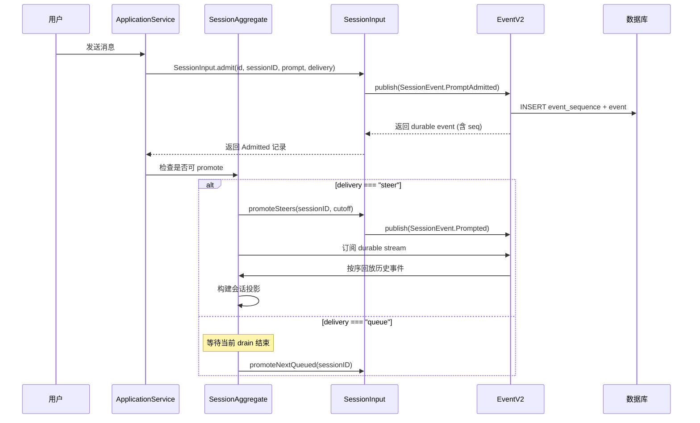
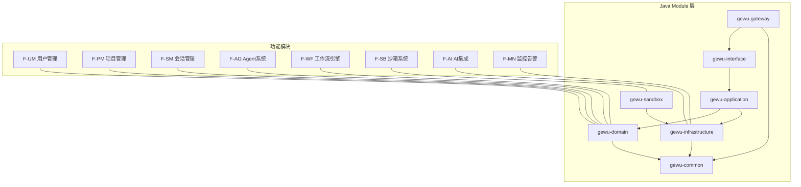
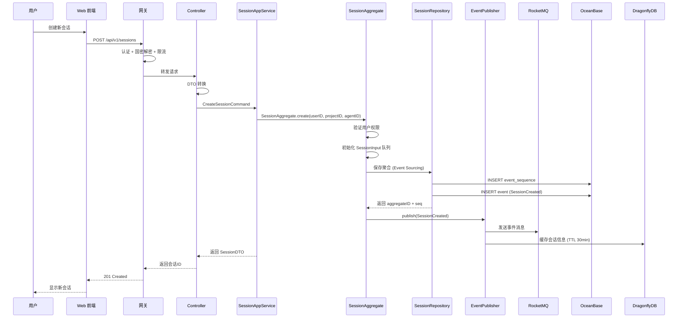
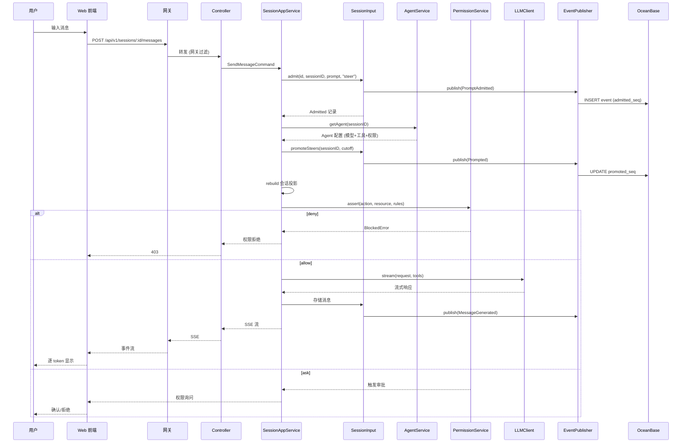
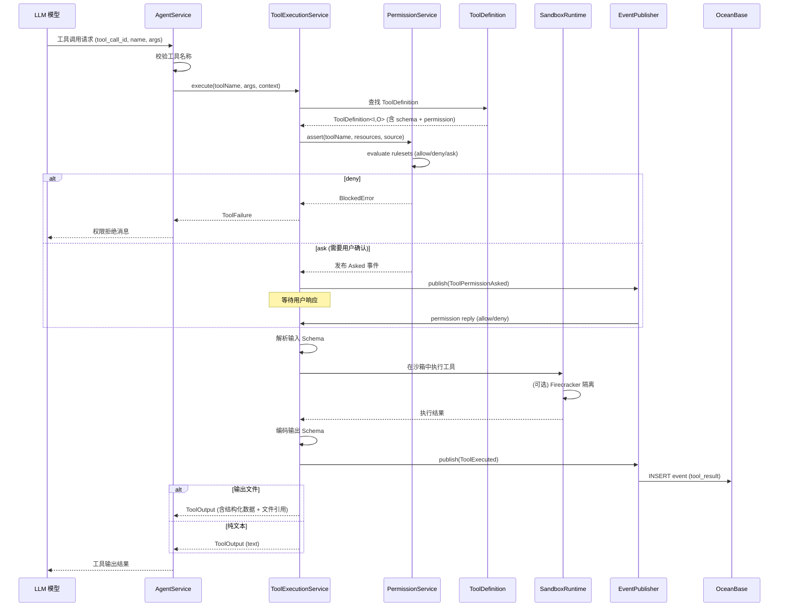
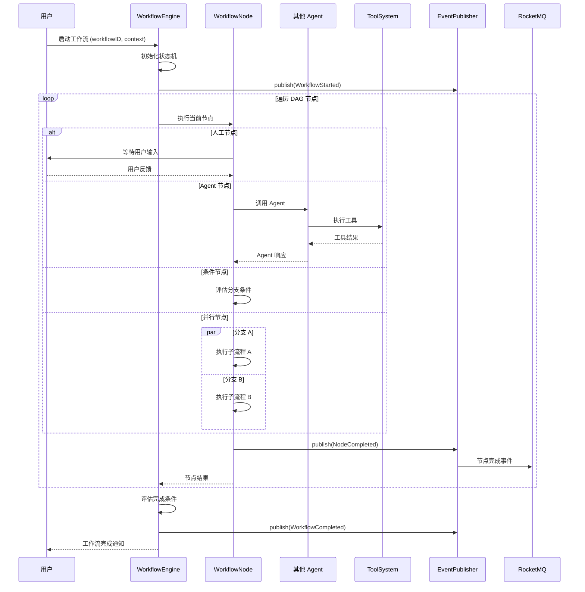
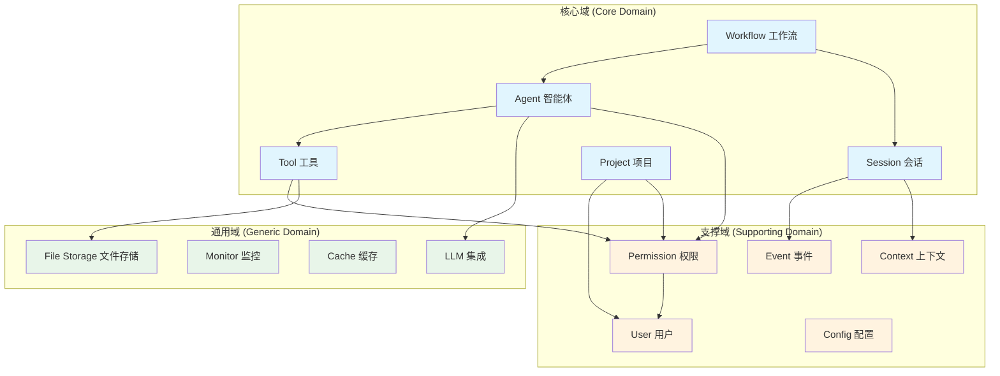

# 格物平台统一技术架构 V1.0

## 文档信息

| 项目 | 内容 |
|------|------|
| 文档名称 | 格物平台统一技术架构 |
| 版本 | V1.2 |
| 创建日期 | 2026-07-08 |
| 文档状态 | 初稿 |
| 更新说明 | V1.1: 新增 §6.5 沙箱模块架构（三级沙箱/预热池/资源限制）；扩展参考文档列表 V1.2: 新增 ADR-023 网关选型决策（Spring Cloud Gateway 优先）、新增 §9.3 性能 SLA 定义 |
| 项目根目录 | `/home/wnn/devcode/ai-code/gewu-platform` |
| 参考架构 | OpenCode 1.17.14 (`/home/wnn/devcode/ai-code/opencode-1.17.14`) |

---

## 目录

1. [架构总览](#1-架构总览)
2. [从 OpenCode 到格物的架构演进](#2-从-opencode-到格物的架构演进)
3. [双层架构描述](#3-双层架构描述)
4. [模块架构](#4-模块架构)
5. [技术栈对比](#5-技术栈对比)
6. [四层架构详解](#6-四层架构详解)
7. [数据流设计](#7-数据流设计)
8. [DDD 限界上下文映射](#8-ddd-限界上下文映射)
9. [关键设计决策](#9-关键设计决策)
10. [附录](#10-附录)

---

## 1. 架构总览

格物平台是一个 **AI 驱动的智能开发协作平台**，采用分层架构 + DDD 模式。其技术架构设计受 OpenCode 1.17.14 的函数式/事件驱动架构深度启发，将现代 AI 应用设计的先进理念与信创合规的企业级需求融合。

### 1.1 核心设计原则

| 原则 | OpenCode 体现 | 格物体现 |
|------|--------------|---------|
| **单一职责** | 31 packages 各司其职 | 7 Java modules + 9 功能模块 |
| **依赖反转** | Effect Context/Layer DI | Spring IoC + DDD Repository 接口 |
| **函数式优先** | Effect 4.0 纯函数式 | CQRS + 领域事件 |
| **事件驱动** | EventV2 + event_sequence 表 | RocketMQ + 领域事件 |
| **插件化** | Plugin System + MCP | 自研插件机制 |
| **安全沙箱** | File/Shell/Network 三层沙箱 | Firecracker/gVisor/Docker 三级沙箱 |
| **信创合规** | N/A (开发工具) | 国密 SM2/SM3/SM4 + 国产数据库/中间件 |

### 1.2 整体架构图

```mermaid
graph TB
    subgraph "表现层 (Presentation)"
        WEB[Web 前端 React 18 + Ant Design]
        DESKTOP[桌面客户端 Electron 28+]
    end

    subgraph "网关层 (Gateway) ← ADR-023"
        GW[API 网关 Spring Cloud Gateway + 国密 Filter]
        GW_F[路由 | 认证 | 限流 | 国密 TLS | 协议转换]
    end

    subgraph "接口层 (Interface)"
        REST[REST API Spring MVC]
        WS[WebSocket Netty]
        SSE[SSE 端点]
    end

    subgraph "应用层 (Application)"
        CMD[Command 处理]
        QRY[Query 处理]
        DTO[DTO 转换]
        APPS[Application Service]
    end

    subgraph "领域层 (Domain)"
        SESSION["会话聚合 Session (Event Sourcing)"]
        AGENT["Agent 聚合"]
        TOOL["Tool 聚合"]
        PERM["权限聚合"]
        WF["工作流聚合"]
        PROJ["项目聚合"]
        EVENT["事件聚合 EventV2"]
        CTX["上下文聚合 ContextEpoch"]
    end

    subgraph "基础设施层 (Infrastructure)"
        PERS[持久化 MyBatis-Plus]
        CACHE[缓存 DragonflyDB/Redisson]
        MQ[消息 RocketMQ]
        LLM_Client[LLM 客户端 通义/DeepSeek]
        SM[国密 SM2/SM3/SM4 Bouncy Castle]
        SANDBOX[沙箱 Firecracker/gVisor]
    end

    subgraph "外部系统"
        LLM[LLM 模型服务]
        MCP[MCP 工具服务]
        OBS[监控 Nightingale]
    end

    WEB --> GW
    DESKTOP --> GW
    GW --> REST
    GW --> WS
    GW --> SSE
    REST --> CMD
    REST --> QRY
    CMD --> SESSION
    CMD --> AGENT
    CMD --> TOOL
    CMD --> PERM
    CMD --> WF
    CMD --> PROJ
    CMD --> CTX
    QRY --> SESSION
    QRY --> PROJ
    AGENT --> LLM_Client
    TOOL --> SANDBOX
    TOOL --> MCP
    SESSION --> EVENT
    SESSION --> PERS
    PERM --> CACHE
    PERM --> EVENT
    EVENT --> MQ
    LLM_Client --> LLM
    OBS --> GW
    OBS --> PERS
    OBS --> MQ
```

---

## 2. 从 OpenCode 到格物的架构演进

OpenCode 是一个单进程、函数式、事件驱动的 AI 编程助手，其架构设计理念为格物的企业级 AI 协作平台提供了重要参考。以下映射表展示了每个 OpenCode 核心概念在格物架构中的演进方式。

### 2.1 核心概念映射

| OpenCode 概念 | 格物架构映射 | 演进说明 |
|--------------|-------------|---------|
| **Effect 函数式框架** | Spring Boot + DDD + CQRS | OpenCode 使用 Effect 4.0 实现纯函数式组合和依赖注入；格物使用 Spring IoC + CQRS 模式实现类似的效果，辅以 DDD 领域事件的函数式风格查询 |
| **SessionV2 会话** | `gewu-domain/session` + 事件溯源 | OpenCode 的 V2 Session 架构（`session/input.ts`, `session/event.ts`, `session/execution.ts`）采用事件溯源（event_sequence + event 表）持久化会话状态。格物直接沿用此模式，但将存储从 SQLite 升级为 OceanBase |
| **SessionInput 消息输入** | 领域层 Session Aggregate | OpenCode 的 `SessionInput.admit()` → `SessionInput.promoteSteers()` → `SessionInput.promoteNextQueued()` 三级消息管道直接映射为格物 Session 聚合根的 admit → promote → consume 生命周期 |
| **Delivery 模式** | 消息投递策略 | OpenCode 的 `steer` / `queue` 两种 delivery 语义——steer 立即推进、queue 等待空闲时推进——格物直接复用此设计 |
| **Tool 工具系统** | `gewu-domain/tool` + 工具注册表 | OpenCode 的 `Tool.make()` 模式（`tool/tool.ts`）定义工具为 schema-in / schema-out 的纯函数，通过 `Tool.withPermission()` 附加权限声明。格物将此抽象为 Java 的 `ToolDefinition<T, R>` 泛型接口 |
| **PermissionV2** | `gewu-domain/permission` + 权限缓存 | OpenCode 的 allow/deny/ask 三级权限模型（`permission.ts:76-86`），通过 `Permission.evaluate()` 通配符匹配规则集。格物将其扩展为 RBAC + 国密签名 + 等保2.0三级 |
| **EventV2 事件引擎** | `gewu-infrastructure/event` + RocketMQ | OpenCode 的 EventV2 提供 `publish / subscribe / durable / replay / project` 五类操作，基于 SQLite + PubSub。格物将事件持久化层替换为 RocketMQ 以支持分布式，保留 durable event 的 aggregate 语义 |
| **ContextEpoch** | 上下文管理 + 向量缓存 | OpenCode 的 `SessionContextEpoch` 管理会话历史选择，格物扩展为基于 DragonflyDB 的向量缓存 + System Context 选择器 |
| **AgentV2** | `gewu-domain/agent` | OpenCode 的 Agent 系统管理模型选择、工具注册、权限策略。格物增加 Agent 编排、热更新、灰度能力 |
| **MCP (Model Context Protocol)** | `gewu-sandbox` + 工具网关 | OpenCode 的 MCP 集成外部工具服务器。格物通过 Firecracker 沙箱 + 工具网关统一管理外部工具生命周期 |
| **Location 模型** | 租户 + 项目隔离 | OpenCode 的 Location（directory + workspaceID）映射为格物的租户 + 项目二级隔离模型 |
| **Event sourcing event_sequence + event** | OceanBase 事件表 | OpenCode 的 `EventSequenceTable` + `EventTable`（`event/sql.ts`）使用 SQLite 的 uniqueIndex 保证 aggregate 序列一致性。格物使用 OceanBase 分布式事务 + RocketMQ 事务消息保证跨服务一致性 |

### 2.2 OpenCode Session V2 架构引用

OpenCode 的 Session V2 架构是格物会话模块的直接设计参考。其核心数据流如下：



格物在每个关键点做了演进：
- **Admit**: 增加国密签名验证消息完整性
- **Durable event**: 使用 RocketMQ 事务消息替代 SQLite transaction
- **Projection**: 支持多副本投影（Web/Desktop/SSE 推送）
- **Promote 策略**: 增加优先级队列（VIP 用户 steer 插队）

### 2.3 Tool 系统引用

OpenCode 的 Tool 系统设计哲学——纯函数、Schema 约束、权限声明——在格物中以 Java 泛型实现：

```java
// OpenCode 的 TypeScript 定义
// Config<Input, Output> = { description, input, output, execute, toModelOutput }

// 格物的 Java 等价定义
public interface ToolDefinition<I, O> {
    String getName();
    String getDescription();
    Class<I> getInputType();
    Class<O> getOutputType();
    O execute(I input, ToolContext context);
    Optional<String> getPermissionAction();
}
```

### 2.4 Permission 系统引用

OpenCode 的 `allow/deny/ask` 三级模型（`permission.ts:76-86`）：

```typescript
export function evaluate(action: string, resource: string, ...rulesets: Permission.Ruleset[]): Permission.Rule {
    return rulesets.flat().findLast(
        (rule) => Wildcard.match(action, rule.action) && Wildcard.match(resource, rule.resource)
    ) ?? { action, resource: "*", effect: "ask" }
}
```

格物保留此三层语义，但将通配符匹配替换为基于 RBAC 角色的规则评估，并增加国密签名验证：

| OpenCode Effect | 格物映射 | 说明 |
|----------------|---------|------|
| `allow` | 显式授权 + 签名 | 匹配 RBAC 角色 + SM2 签名验证 |
| `deny` | 拒绝 + 审计日志 | 记录到安全审计 |
| `ask` | 审批流程 | 触发审批工作流（RocketMQ 事件驱动） |

---

## 3. 双层架构描述

### 3.1 顶层架构：格物 DDD + 微服务

```
┌───────────────────────────────────────────────────────────────────┐
│                    表现层 (Presentation)                          │
│  ┌──────────────┐  ┌──────────────┐                              │
│  │  Web 前端     │  │  桌面端      │                              │
│  │  React 18     │  │  Electron 28 │                              │
│  └──────┬───────┘  └──────┬───────┘                              │
└─────────┼──────────────────┼──────────────────────────────────────┘
          │                  │
┌─────────▼──────────────────▼──────────────────────────────────────┐
│                    网关层 (Gateway) ← ADR-023                      │
│        Spring Cloud Gateway + 国密 Filter (Reactor Netty)          │
│  路由转发 | 认证授权 | 限流熔断 | 国密加密 | 协议转换 | SSE 支持    │
└──────────────────────────────┬────────────────────────────────────┘
                               │
┌──────────────────────────────▼────────────────────────────────────┐
│                    接口层 (Interface)                              │
│  ┌──────────────┐  ┌──────────────┐  ┌──────────────┐            │
│  │  REST API    │  │  WebSocket   │  │  SSE 端点    │            │
│  └──────┬───────┘  └──────┬───────┘  └──────┬───────┘            │
└─────────┼──────────────────┼──────────────────┼────────────────────┘
          │                  │                  │
┌─────────▼──────────────────▼──────────────────▼────────────────────┐
│                    应用层 (Application)                            │
│  ┌──────────────┐  ┌──────────────┐  ┌──────────────┐            │
│  │  Command 处理  │  │  Query 处理   │  │  DTO 转换     │            │
│  └──────┬───────┘  └──────┬───────┘  └──────┬───────┘            │
└─────────┼──────────────────┼──────────────────┼────────────────────┘
          │                  │                  │
┌─────────▼──────────────────▼──────────────────▼────────────────────┐
│                    领域层 (Domain)                                 │
│  ┌──────────┐┌──────────┐┌──────────┐┌──────────┐┌──────────┐   │
│  │ 会话聚合  ││ Agent 聚合││ Tool 聚合││ 权限聚合  ││ 工作流聚合│   │
│  │ Session  ││ Agent    ││ Tool     ││ Permission││ Workflow │   │
│  ├──────────┤├──────────┤├──────────┤├──────────┤├──────────┤   │
│  │ 项目聚合  ││ 事件聚合  ││ 上下文聚合 ││          ││          │   │
│  │ Project  ││ Event    ││ Context  ││          ││          │   │
│  └──────────┘└──────────┘└──────────┘└──────────┘└──────────┘   │
└────────────────────────────────┬──────────────────────────────────┘
                                 │
┌────────────────────────────────▼──────────────────────────────────┐
│                    基础设施层 (Infrastructure)                     │
│  ┌──────────┐┌──────────┐┌──────────┐┌──────────┐┌──────────┐   │
│  │ 持久化    ││ 缓存      ││ 消息队列  ││ 国密算法  ││ LLM 客户端│   │
│  │ MyBatis+  ││ Dragonfly││ RocketMQ ││ SM2/3/4  ││ 通义/DS  │   │
│  ├──────────┤├──────────┤├──────────┤├──────────┤├──────────┤   │
│  │ 沙箱运行时 ││ 监控     ││ 文件存储  ││          ││          │   │
│  │ Firecracker││ Nightin'││ OSS     ││          ││          │   │
│  └──────────┘└──────────┘└──────────┘└──────────┘└──────────┘   │
└───────────────────────────────────────────────────────────────────┘
```

### 3.2 参考层：OpenCode 函数式/事件驱动架构

OpenCode 的架构作为参考层，代表了现代 AI 应用在架构层面的最佳实践：

```
┌───────────────────────────────────────────────────────────────────┐
│                    前端层 (Presentation)                          │
│  ┌──────────┐  ┌──────────┐  ┌──────────┐                       │
│  │ Web App  │  │ Desktop  │  │ TUI      │                       │
│  │ SolidJS  │  │ Electron │  │ OpenTUI  │                       │
│  └────┬─────┘  └────┬─────┘  └────┬─────┘                       │
└───────┼──────────────┼──────────────┼─────────────────────────────┘
        │              │              │
┌───────▼──────────────▼──────────────▼─────────────────────────────┐
│                    API 层                                          │
│  ┌──────────┐  ┌──────────┐  ┌──────────┐                       │
│  │ HTTP Svr │  │ WebSocket│  │ SSE     │                       │
│  │ Hono     │  │          │  │ Events  │                       │
│  └────┬─────┘  └────┬─────┘  └────┬─────┘                       │
└───────┼──────────────┼──────────────┼─────────────────────────────┘
        │              │              │
┌───────▼──────────────▼──────────────▼─────────────────────────────┐
│                   业务层 (Business + Effect)                      │
│  ┌──────────┐  ┌──────────┐  ┌──────────┐  ┌──────────┐         │
│  │SessionV2 │  │ AgentV2  │  │ Tool Sys │  │ Permission│         │
│  │ 事件溯源  │  │ 函数式   │  │ 纯函数   │  │ allow/ask │         │
│  └──────────┘  └──────────┘  └──────────┘  └──────────┘         │
└────────────────────────────┬──────────────────────────────────────┘
                             │
┌────────────────────────────▼──────────────────────────────────────┐
│                   数据层 (SQLite + Event Store)                    │
│  ┌──────────┐  ┌──────────┐  ┌──────────┐                       │
│  │ Drizzle  │  │ Event    │  │ File Sys │                       │
│  │ ORM      │  │ Sequence │  │ Sandbox  │                       │
│  └──────────┘  └──────────┘  └──────────┘                       │
└───────────────────────────────────────────────────────────────────┘
```

### 3.3 架构对比

| 维度 | 格物 (主架构) | OpenCode (参考架构) |
|------|-------------|-------------------|
| **架构风格** | DDD + 分层 + 微服务 | 函数式 + 单进程 + 插件化 |
| **运行时** | JDK 21 (国产) + Spring Boot 3.x | Bun 1.3.14 + TypeScript 5.8 |
| **DI 机制** | Spring IoC / @Autowired | Effect Context / Layer |
| **事务** | Spring @Transactional + OceanBase 分布式事务 | SQLite transaction + Event Sourcing |
| **消息传递** | RocketMQ 异步消息 | EventV2 PubSub + Stream |
| **前端** | React 18 + Ant Design | SolidJS + SolidStart |
| **部署** | K8s 多副本 | Docker / K8s 单副本 |
| **安全** | 国密 + 等保2.0三级 | OAuth 2.0 + API Key |
| **数据库** | OceanBase 分布式 | SQLite 单机 |

---

## 4. 模块架构

### 4.1 9 大功能模块 (F-UM ~ F-MN)

| 编号 | 模块 | 英文 | 领域包 | 核心职责 |
|------|------|------|--------|---------|
| F-UM | 用户管理 | User Management | `gewu-domain/user` | 注册登录、JWT、OAuth2.0、RBAC、国密 |
| F-PM | 项目管理 | Project Management | `gewu-domain/project` | 项目CRUD、成员管理、配置、统计分析 |
| F-SM | 会话管理 | Session Management | `gewu-domain/session` | 会话CRUD、消息历史、SSE推送、事件溯源 |
| F-AG | Agent 系统 | Agent System | `gewu-domain/agent` | 模型配置、工具注册、权限评估、Agent执行 |
| F-WF | 工作流引擎 | Workflow Engine | `gewu-domain/workflow` | 状态机、并行流程、可视化设计器 |
| F-SB | 沙箱系统 | Sandbox System | `gewu-sandbox` | 隔离执行、安全策略、资源管理 |
| F-GW | 网关服务 | Gateway Service | `gewu-gateway` | 路由、认证、限流、国密、协议转换 |
| F-AI | AI 集成 | AI Integration | `gewu-infrastructure/llm` | LLM 调用、流式响应、模型管理 |
| F-MN | 监控告警 | Monitor & Alert | `gewu-infrastructure/monitor` | 指标采集、告警、日志、链路追踪 |

### 4.2 模块依赖关系



### 4.3 模块内聚合设计 (参考 OpenCode SessionV2 + Tool 模式)

以 F-SM 会话模块为例，每个模块内部采用四层结构：

```text
gewu-domain/session/
├── aggregate/           # 聚合根
│   ├── Session.java          # 会话聚合根
│   ├── SessionInput.java     # 消息输入（复用 OpenCode Admit/Promote 模式）
│   └── SessionEvent.java     # 会话事件
├── entity/              # 实体
│   ├── Message.java          # 消息实体
│   └── SessionMember.java    # 会话成员
├── vo/                  # 值对象
│   ├── Prompt.java           # 提示词
│   └── Delivery.java         # 投递方式 (steer | queue)
├── repository/          # 仓库接口
│   └── SessionRepository.java
├── service/             # 领域服务
│   └── SessionDomainService.java
└── event/               # 领域事件
    ├── SessionCreatedEvent.java
    └── MessageSentEvent.java
```

---

## 5. 技术栈对比

### 5.1 技术栈全景对比表

| 层次 | OpenCode | 格物 (信创) | 格物 (备选) |
|------|----------|-------------|-------------|
| **运行时** | Bun 1.3.14 | 国产 JDK 21+ (龙芯/鲲鹏/飞腾) | OpenJDK 21 |
| **语言** | TypeScript 5.8.2 | Java 21 | - |
| **应用框架** | Effect 4.0.0-beta.83 | Spring Boot 3.2+ | - |
| **Web 框架** | Hono 4.10.7 | Spring MVC + Netty | - |
| **数据库** | SQLite | OceanBase 4.2+ | MySQL 8.0 |
| **ORM** | Drizzle ORM 1.0.0-rc.2 | MyBatis-Plus 3.5+ | - |
| **缓存** | (无) | DragonflyDB 1.27+ | Redis 7.0 |
| **消息队列** | EventV2 PubSub | RocketMQ 5.1+ | Kafka 3.5+ |
| **前端框架** | SolidJS 1.9.10 | React 18+ | - |
| **UI 组件** | OpenTUI 0.4.3 | Ant Design 5+ | - |
| **桌面端** | Electron/Tauri | Electron 28+ | - |
| **构建工具** | Vite 7.1.4 / Turborepo | Maven 3.8+ | - |
| **API 网关** | Hono Router | Spring Cloud Gateway + 国密 Filter | 自研 Netty (Phase 2 备选) |
| **AI SDK** | Vercel AI SDK 6.0.168 | 通义/DeepSeek SDK | - |
| **沙箱** | File/Shell/Network | Firecracker / gVisor | Docker |
| **安全** | OAuth 2.0 + API Key | SM2/SM3/SM4 + JWT + RBAC | - |
| **监控** | OpenTelemetry + Sentry | Nightingale + Categraf | Prometheus + Grafana |
| **部署** | Docker / K8s / SST | K8s / KubeEdge / iSulad | Docker Compose |
| **CI/CD** | GitHub Actions | Gitea + Drone | Jenkins |
| **包管理** | Bun Workspaces | Maven Multi-module | - |
| **代码检查** | OxLint + Prettier | SonarQube | - |
| **测试** | Playwright 1.59.1 | JUnit 5 + Mockito | - |

### 5.2 架构范式对比

| 维度 | OpenCode (函数式) | 格物 (DDD + OOP) |
|------|-----------------|-----------------|
| **状态管理** | Effect Ref / Context | Spring Bean + Repository |
| **副作用** | Effect 类型化 | Service 层封装 |
| **依赖注入** | Layer / Context | @Autowired / IoC |
| **错误处理** | Effect.Effect<T, E> | @ControllerAdvice + 异常体系 |
| **并发** | Effect Fiber / Stream | Spring Async + CompletableFuture |
| **事务** | Event Sourcing | @Transactional + 分布式事务 |
| **序列化** | Effect Schema (类型安全) | Jackson + DTO |
| **测试** | Effect Test (纯函数) | Mockito + SpringBootTest |

---

## 6. 四层架构详解

### 6.1 网关层 (Gateway Layer)

```
gewu-gateway/
├── src/main/java/com/gewu/gateway/
│   ├── filter/               # 过滤器链
│   │   ├── AuthFilter.java        # JWT / OAuth 认证
│   │   ├── RateLimitFilter.java   # 令牌桶限流
│   │   ├── SMFilter.java          # 国密 SM2/SM3/SM4 加解密
│   │   ├── AuditFilter.java       # 操作审计日志
│   │   └── CircuitBreaker.java    # 熔断器
│   ├── router/               # 路由引擎
│   │   ├── Router.java            # 动态路由
│   │   └── LoadBalancer.java      # 负载均衡
│   ├── protocol/             # 协议转换
│   │   ├── HttpProtocol.java
│   │   ├── WebSocketProtocol.java
│   │   └── GrpcProtocol.java
│   └── sse/                  # SSE 长连接管理
│       └── SSEManager.java
```

参考 OpenCode 的 Hono Router + Middleware 模式，格物网关实现了类似的过滤器链机制，但增加了国密运算和信创审计能力。

### 6.2 应用层 (Application Layer)

```
gewu-application/
├── src/main/java/com/gewu/application/
│   ├── command/              # 命令处理 (CQRS 写)
│   │   ├── session/
│   │   │   ├── CreateSessionCommand.java
│   │   │   ├── SendMessageCommand.java
│   │   │   └── EndSessionCommand.java
│   │   └── agent/
│   │       ├── ExecuteToolCommand.java
│   │       └── InvokeAgentCommand.java
│   ├── query/                # 查询处理 (CQRS 读)
│   │   ├── session/
│   │   │   ├── SessionListQuery.java
│   │   │   └── MessageHistoryQuery.java
│   │   └── tool/
│   │       └── ToolRegistryQuery.java
│   └── dto/                  # DTO
│       ├── SessionDTO.java
│       └── MessageDTO.java
```

Command 处理遵循 OpenCode 的 `SessionInput.admit()` 模式：每个 Command 对应一个领域事件，通过 RocketMQ 推送事件。

### 6.3 领域层 (Domain Layer)

```
gewu-domain/
├── src/main/java/com/gewu/domain/
│   ├── session/
│   │   ├── aggregate/
│   │   │   └── SessionAggregate.java    # 会话聚合根
│   │   ├── entity/
│   │   │   ├── Message.java
│   │   │   └── SessionMember.java
│   │   ├── vo/
│   │   │   ├── Prompt.java
│   │   │   └── Delivery.java
│   │   └── repository/
│   │       └── SessionRepository.java
│   ├── agent/
│   │   ├── aggregate/
│   │   │   └── AgentAggregate.java
│   │   ├── entity/
│   │   │   └── ToolRegistration.java
│   │   └── repository/
│   │       └── AgentRepository.java
│   ├── tool/
│   │   ├── entity/
│   │   │   └── ToolDefinition.java
│   │   └── service/
│   │       └── ToolExecutionService.java
│   ├── permission/
│   │   ├── aggregate/
│   │   │   └── PermissionAggregate.java
│   │   ├── vo/
│   │   │   └── Policy.java
│   │   └── service/
│   │       └── PermissionEvaluateService.java
│   ├── workflow/
│   │   ├── aggregate/
│   │   │   └── WorkflowAggregate.java
│   │   └── entity/
│   │       └── WorkflowNode.java
│   ├── project/
│   │   ├── aggregate/
│   │   │   └── ProjectAggregate.java
│   │   └── entity/
│   │       └── ProjectMember.java
│   ├── event/
│   │   └── DomainEvent.java         # 领域事件基类
│   └── context/
│       └── ContextEpoch.java       # 上下文管理
```

### 6.4 基础设施层 (Infrastructure Layer)

```
gewu-infrastructure/
├── src/main/java/com/gewu/infrastructure/
│   ├── persistence/           # 持久化 (MyBatis-Plus)
│   │   ├── session/
│   │   │   ├── SessionMapper.java
│   │   │   └── SessionRepositoryImpl.java
│   │   └── event/
│   │       ├── EventMapper.java
│   │       └── EventSequenceMapper.java
│   ├── cache/                 # 缓存 (DragonflyDB / Redisson)
│   │   ├── SessionCache.java
│   │   └── PermissionCache.java
│   ├── event/                 # 消息 (RocketMQ)
│   │   ├── EventPublisher.java     # 参考 EventV2.publish()
│   │   └── EventSubscriber.java    # 参考 EventV2.subscribe()
│   ├── llm/                   # LLM 客户端
│   │   ├── LLMClient.java         # 参考 OpenCode aisdk.ts
│   │   ├── TongyiClient.java
│   │   └── DeepSeekClient.java
│   └── security/              # 国密
│       ├── SM2Util.java
│       ├── SM3Util.java
│       └── SM4Util.java
```

---

### 6.5 沙箱模块架构 (gewu-sandbox)

沙箱模块是格物平台的独立服务，提供安全的代码/工具执行环境。详细设计见 `27-agent-sandbox-design.md`。

```
gewu-sandbox/
├── src/main/java/com/gewu/sandbox/
│   ├── manager/                 # 沙箱管理器
│   │   ├── SandboxManager.java        # 沙箱管理器接口
│   │   ├── FirecrackerSandboxManager.java  # Firecracker MicroVM (L1)
│   │   ├── GVisorSandboxManager.java      # gVisor 用户态内核 (L2)
│   │   ├── iSuladSandboxManager.java      # iSulad 容器 (L3, 信创)
│   │   └── KubernetesSandboxManager.java  # K8s Pod (云端)
│   ├── scheduler/               # 调度器
│   │   ├── SandboxScheduler.java      # 沙箱调度器 (最小负载优先)
│   │   ├── ResourcePoolManager.java   # 资源池管理 (CPU/内存/磁盘/网络)
│   │   └── WarmPoolManager.java       # 容器预热池 (small/medium/large)
│   ├── security/                # 安全策略
│   │   ├── SecurityPolicy.java       # 安全策略 (FS/网络/进程/资源/审计)
│   │   ├── CommandFilter.java        # 命令白名单过滤
│   │   └── NetworkPolicy.java        # 网络访问控制 (域名/端口白名单)
│   ├── audit/                   # 审计日志
│   │   └── SandboxAuditService.java  # 命令执行/文件访问审计
│   └── config/                  # 配置
│       └── SandboxConfig.java        # 沙箱配置模型
```

**三级沙箱对比**:

| 等级 | 实现 | 隔离级别 | 启动时间 | 资源开销 | 应用场景 |
|------|------|----------|----------|----------|----------|
| **L1** | Firecracker MicroVM | 硬件级虚拟化 | 3-8s | 高 (~200MB) | 不可信代码执行 |
| **L2** | gVisor (runsc) | 内核级拦截 | 1-3s | 中 (~50MB) | 内部 Agent 工具执行 |
| **L3** | iSulad 容器 | 操作系统级 | <1s | 低 (~10MB) | 可信环境快速启动 (信创) |

**沙箱生命周期**:
```
创建 → (预热池获取 / 即时创建) → 配置网络 (IP 池) → 挂载文件系统 → 执行命令 → 审计记录 → 销毁 (IP 回收)
```

**资源限制**:
- CPU: millicores 粒度 (100m 步进)
- 内存: bytes 粒度 (最小 128MB)
- 磁盘: bytes 粒度 (最小 1GB, EmptyDir 卷)
- 网络: Mbps 带宽限制 (最小 1Mbps)

**预热池配置**:
- Small: 100 个实例预热, 轻量任务
- Medium: 50 个实例预热, 标准任务
- Large: 20 个实例预热, 计算密集型
- 补池策略: 虚拟线程每 5 秒检测池容量, 不足时自动补充

---

## 7. 数据流设计

### 7.1 会话创建流程



### 7.2 消息发送流程



### 7.3 工具执行流程



### 7.4 工作流执行流程



---

## 8. DDD 限界上下文映射

### 8.1 OpenCode 模块 → 格物领域上下文

| OpenCode 模块 | 格物 Bounded Context | 映射类型 | 说明 |
|--------------|---------------------|---------|------|
| `core/session` | `Session` (F-SM) | 直接映射 | SessionV2 事件溯源 → Session 聚合 + Event 表 |
| `core/agent` | `Agent` (F-AG) | 直接映射 | AgentV2 → Agent 聚合 + Tool 注册 |
| `core/permission` | `Permission` (F-UM) | 增强映射 | allow/deny/ask → RBAC + 国密 + 审批流 |
| `core/tool` | `Tool` (F-AG) | 直接映射 | Tool.make() → ToolDefinition<I,O> |
| `core/project` | `Project` (F-PM) | 直接映射 | 项目 + 成员管理 |
| `core/event` | `Event` (共享) | 直接映射 | EventV2 → RocketMQ + Event 表 |
| `core/location` | `Tenant + Project` | 增强映射 | Location → 租户隔离 + 项目作用域 |
| `server` | `Gateway + Interface` | 参考映射 | Hono Routes → 网关路由 + Controller |
| `llm` | `AI Integration` (F-AI) | 直接映射 | AI SDK → LLMClient |
| `core/plugin` | `Plugin` (跨模块) | 参考映射 | Plugin 系统 → SPI + 热插拔 |
| `core/system-context` | `Context` (F-SM) | 直接映射 | ContextEpoch → 上下文管理 |
| `core/config` | `Config` (F-PM) | 参考映射 | 配置管理 |
| `app` (SolidJS) | `gewu-web` (React) | 参考映射 | UI 框架不同，组件模式类似 |
| `tui` (OpenTUI) | `gewu-web` 控制台 | 概念映射 | 终端 UI → Web 控制台 |
| `desktop` | `gewu-desktop` (Electron) | 直接映射 | 桌面应用 |

### 8.2 限界上下文地图



### 8.3 上下文间事件流

```text
Session 上下文 → (MessageSent)           → Agent 上下文
Agent 上下文    → (ToolInvoked)           → Tool 上下文
Agent 上下文    → (AgentResponded)        → Session 上下文
Tool 上下文     → (PermissionRequested)   → Permission 上下文
Permission 上下文 → (PermissionResolved)  → Tool 上下文
Workflow 上下文 → (WorkflowStarted)       → Agent 上下文
Workflow 上下文 → (NodeCompleted)         → Session 上下文
Project 上下文  → (MemberAdded)          → Permission 上下文
Session 上下文  → (SessionEnded)         → Context 上下文
```

---

## 9. 关键设计决策

### 9.1 决策对比表

| 决策点 | OpenCode 选择 | 格物选择 | 决策理由 |
|--------|-------------|---------|---------|
| **架构风格** | 函数式 + 事件驱动 | DDD + 分层 + 微服务 | 格物需要企业级团队协作、多模块并行开发；DDD 更适合 Java 技术栈 |
| **运行时** | Bun (Node.js 替代) | 国产 JDK 21 | 信创合规，飞腾/鲲鹏/龙芯均有 JDK 支持 |
| **应用框架** | Effect 4.0 | Spring Boot 3.2+ | Spring Boot 是国内企业级主流，生态成熟，人才充裕 |
| **数据库** | SQLite | OceanBase 4.2+ | OceanBase 分布式、MySQL 兼容、信创合规；单机性能可满足 MVP |
| **ORM** | Drizzle ORM (类型安全) | MyBatis-Plus | 国内 Java 生态标准选择，动态 SQL 灵活 |
| **缓存** | (无) | DragonflyDB | 需要会话缓存、权限缓存、分布式锁 |
| **消息队列** | EventV2 PubSub | RocketMQ | 需要跨服务事件驱动，RocketMQ 信创合规 |
| **前端** | SolidJS | React 18 + Ant Design | Ant Design 适合企业级中后台，生态丰富 |
| **API 网关** | Hono Router | Spring Cloud Gateway + 国密 Filter | 信创合规 + 国密集成 + 生态成熟 (ADR-023) |
| **AI SDK** | Vercel AI SDK | 通义/DeepSeek SDK | 国产大模型信创合规 |
| **沙箱** | File/Shell/Network 三级 | Firecracker + gVisor | 企业级隔离需求更高，需要硬件级隔离 |
| **安全模型** | OAuth 2.0 + API Key | SM2/SM3/SM4 + JWT + RBAC | 国密合规 + 等保2.0三级 |
| **事件溯源** | event_sequence + event 表 | event_sequence + RocketMQ | RocketMQ 提供跨服务分布式事件一致性 |
| **会话持久化** | SQLite 事件存储 | OceanBase 事件表 | 分布式场景需要共享存储 |
| **权限评估** | 通配符匹配 + 规则链 | RBAC + 通配符 + 审批流 | 企业级权限更复杂，需要可审计的三级权限 |
| **状态管理** | Effect Context/Layer | Redisson 分布式缓存 | 微服务多实例需要共享状态 |
| **监控** | OpenTelemetry + Sentry | Nightingale + Prometheus | 信创合规 + 国产监控平台 |

### 9.2 关键 ADR 补充

#### ADR-021: Session 事件溯源方案

**状态**: 待批准

**决策**: 会话模块采用 Event Sourcing 模式，参考 OpenCode `event_sequence + event` 两表设计。

**理由**:
- 完整的 AI 会话历史可回溯、可审计
- 支持会话回滚和分支（多轮对话中的修正）
- 天然支持 SSE 事件推送
- 与 RocketMQ 事件驱动架构一致

**具体实现**:
- 每个会话作为一个 aggregate
- 每次消息发送产生一个 durable event
- 会话投影从事件流重建
- 事件通过 RocketMQ 广播给相关服务

#### ADR-022: Tool 执行沙箱策略

**状态**: 待批准

**决策**: 工具代码在 Firecracker 微 VM 中执行，参考 OpenCode 的沙箱权限模型。

**理由**:
- 企业级安全需求（代码执行隔离）
- 资源隔离（CPU/内存/网络限制）
- 安全审计（执行日志全记录）

**降级方案**: gVisor 容器级隔离（当硬件虚拟化不支持时）

#### ADR-023: API 网关选型

**状态**: 待批准

**决策**: 采用 **Spring Cloud Gateway + 国密 Filter 插件** 为主方案，自研 Java/Netty 网关为备选方案。

**候选方案对比**:

| 维度 | 方案A: Spring Cloud Gateway | 方案B: 自研 Java/Netty | 方案C: APISIX |
|------|---------------------------|----------------------|--------------|
| 成熟度 | ⭐⭐⭐⭐⭐ 生产验证 | ⭐⭐⭐ 需自研 | ⭐⭐⭐⭐⭐ 生产验证 |
| 国密适配 | 中等（自定义 Filter + Bouncy Castle） | 高（全自研可控） | 低（需自研插件） |
| 信创合规 | 支持（已有多家银行验证） | 需独立验证 | 需独立验证 |
| 开发周期 | 1-2 周（配置+Filter 开发） | 8-12 周（全自研） | 2-3 周（插件开发） |
| 维护成本 | 低（社区维护） | 高（团队自维） | 中（开源+商业支持） |
| 性能 (P99) | < 5ms | < 2ms (Netty 原生) | < 3ms |
| 功能完备性 | 路由/限流/熔断/重试/安全头 | 需逐一实现 | 开箱即用 |

**理由**:
- Spring Cloud Gateway 基于 Spring WebFlux（Reactor Netty），与格物 JDK 21 + Spring Boot 3.2 技术栈完全一致
- 国密 TLS 可通过自定义 GatewayFilter 实现，无需重新实现网关核心功能
- 开发周期从 8-12 周缩短到 1-2 周，降低项目风险
- 国内信创已有大量 Spring Cloud Gateway 生产案例（金融/政务行业）

**备选方案保留**: 如果后续信创验收要求必须全自研，自研 Netty 网关方案作为 Phase 2 演进。备选方案重点关注：
- 路由分发（仅此功能自研，认证/限流委托给现有组件）
- 国密 TLS 的 Bouncy Castle Netty Handler 集成
- 与 Nacos 服务发现的无缝对接

---

### 9.3 性能 SLA 定义

| 指标 | P50 | P95 | P99 | 测量方法 | 违反后果 |
|------|-----|-----|-----|---------|---------|
| **API 请求延迟** | < 200ms | < 500ms | < 2s | Prometheus histogram | 触发告警，限流降级 |
| **LLM 首 token 延迟** | < 1s | < 3s | < 10s | LLMClient 指标 | 超时重试 |
| **SSE 事件推送延迟** | < 100ms | < 300ms | < 1s | SSE 端点指标 | 客户端重连 |
| **数据库查询 (简单)** | < 5ms | < 10ms | < 50ms | OB 慢查询日志 | 触发慢查询告警 |
| **事务提交延迟** | < 10ms | < 30ms | < 100ms | OB 事务指标 | 锁超时回滚 |
| **RocketMQ 投递延迟** | < 10ms | < 50ms | < 200ms | MQ 指标 | 触发消息堆积告警 |
| **沙箱启动 (L3)** | < 300ms | < 500ms | < 1s | 沙箱指标 | 触发沙箱启动超时告警 |
| **沙箱启动 (L1)** | < 3s | < 5s | < 10s | 沙箱指标 | 触发沙箱启动超时告警 |
| **缓存查询** | < 1ms | < 3ms | < 10ms | DragonflyDB 指标 | 缓存击穿回源 DB |
| **工作流节点流转** | < 100ms | < 200ms | < 500ms | 工作流引擎指标 | 流转超时告警 |
| **系统可用性** | 99.9% (生产) | — | 99.99% (目标) | Nightingale SLI | P0 事故响应 |
| **系统吞吐量** | ≥ 1000 QPS | ≥ 2000 QPS | ≥ 5000 QPS (峰值) | 网关指标 | 触发限流 |

#### 性能瓶颈预估

| 瓶颈点 | 预估上限 | 扩容策略 |
|--------|---------|---------|
| API 网关 | 5000 QPS (单副本) → 15000 QPS (3 副本) | 水平扩展 + HPA |
| 数据库写入 | 2000 TPS (单 OB 节点) | 读写分离 + 分表 |
| 数据库读取 | 10000 QPS (3 节点) | OBProxy 负载均衡 |
| RocketMQ 吞吐 | 10 万条/s (3 Broker) | 水平扩展 Topic 分区 |
| 沙箱并发数量 | 100 (单节点) → 500 (5 节点) | 水平扩展 + 预热池 |
| LLM 调用 | 30 RPM (单 API Key) | 多 Key 轮转 + 模型降级 |

---

## 10. 附录

### 10.1 参考文档

| 文档 | 版本 | 说明 |
|------|------|------|
| `01-technical-architecture.md` | V5.0 | 格物技术架构总览 |
| `02-deployment-architecture.md` | V5.0 | 部署架构设计 |
| `03-database-design.md` | V5.0 | 数据库设计 |
| `06-monitoring-alerting.md` | V5.0 | 监控告警文档 |
| `07-security-compliance.md` | V5.0 | 安全合规文档 |
| `27-agent-sandbox-design.md` | V1.0 | Agent 沙箱设计（详细架构） |
| `28-workflow-engine-design.md` | V1.0 | 工作流引擎设计（详细架构） |
| `29-xinchuang-compliance.md` | V1.0 | 信创合规适配文档 |
| `opencode-1.17.14/docs/architecture.md` | - | OpenCode 技术架构 (参考) |
| `opencode-1.17.14/packages/core/src/tool/tool.ts` | - | OpenCode 工具系统 (参考) |
| `opencode-1.17.14/packages/core/src/permission.ts` | - | OpenCode 权限系统 (参考) |
| `opencode-1.17.14/packages/core/src/session/input.ts` | - | OpenCode 会话输入 (参考) |
| `opencode-1.17.14/packages/core/src/event.ts` | - | OpenCode 事件引擎 (参考) |

### 10.2 术语对照表

| OpenCode 术语 | 格物术语 | 说明 |
|--------------|---------|------|
| SessionV2 | Session | 会话 |
| SessionInput | SessionInput | 会话输入/admit |
| Delivery | Delivery | 投递方式 (steer/queue) |
| Tool | Tool / ToolDefinition | 工具定义 |
| PermissionV2 | Permission / Policy | 权限策略 |
| EventV2 | DomainEvent | 领域事件 |
| AgentV2 | Agent | 智能体 |
| Location | Tenant / Project | 租户/项目作用域 |
| ContextEpoch | ContextEpoch | 上下文周期 |
| Projection | Projection | 投影/重建 |
| Durable Event | Durable Event | 持久化事件 |
| Aggregate | Aggregate | 聚合 |
| MCP | Tool Gateway | 工具网关 |
| AppProcess | Sandbox Process | 沙箱进程 |

### 10.3 OpenCode 源码参考索引

| 概念 | OpenCode 文件 | 行号 | 格物对应 |
|------|-------------|------|---------|
| Tool.make() | `tool/tool.ts` | 71-132 | ToolDefinition 接口 |
| Tool.withPermission() | `tool/tool.ts` | 139-146 | @PermissionRequired 注解 |
| Permission.evaluate() | `permission.ts` | 76-86 | PermissionEvaluateService |
| PermissionV2.assert() | `permission.ts` | 197-218 | PermissionCheckAspect |
| SessionInput.admit() | `session/input.ts` | 41-81 | SessionInput.admit() |
| SessionInput.promoteSteers() | `session/input.ts` | 245-266 | SessionInput.promoteSteers() |
| SessionInput.promoteNextQueued() | `session/input.ts` | 268-288 | SessionInput.promoteNext() |
| EventV2.publish() | `event.ts` | 419-439 | EventPublisher.publish() |
| EventV2.durable() | `event.ts` | 585-604 | EventStore.durableStream() |
| event_sequence + event | `event/sql.ts` | 1-25 | EventSequence + Event 表 |
| SessionExecution | `session/execution.ts` | 1-34 | SessionExecutor |
| AgentV2 | `agent.ts` | - | AgentAggregate |

---

**文档结束**
