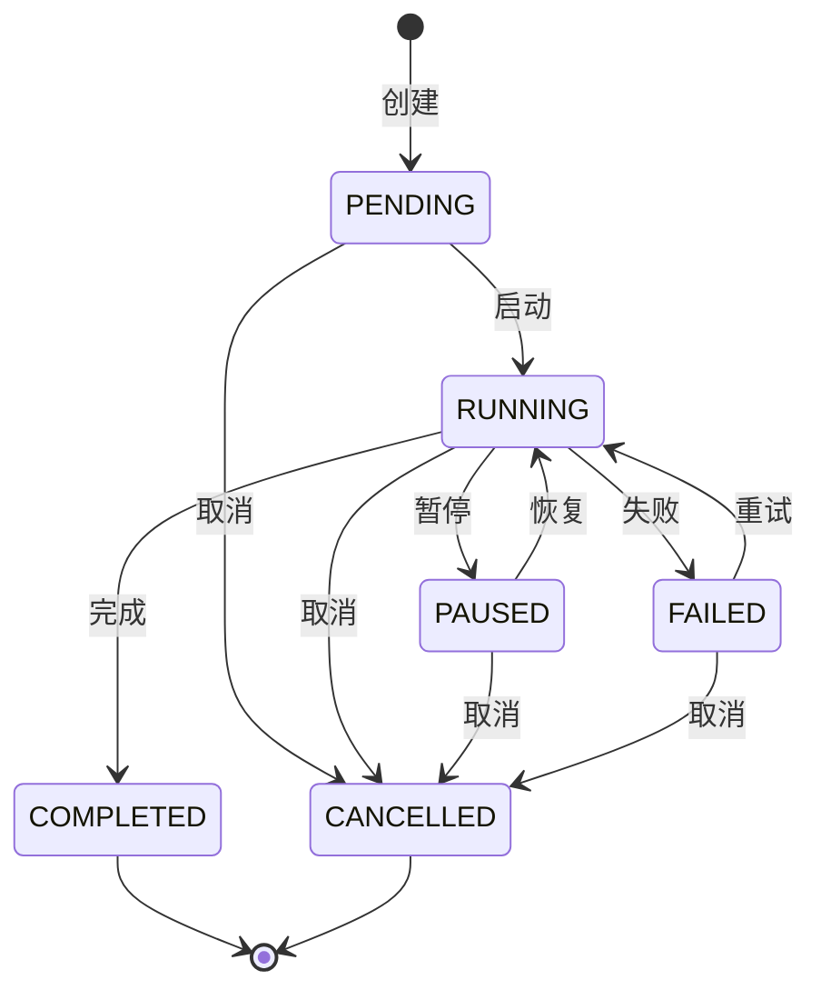
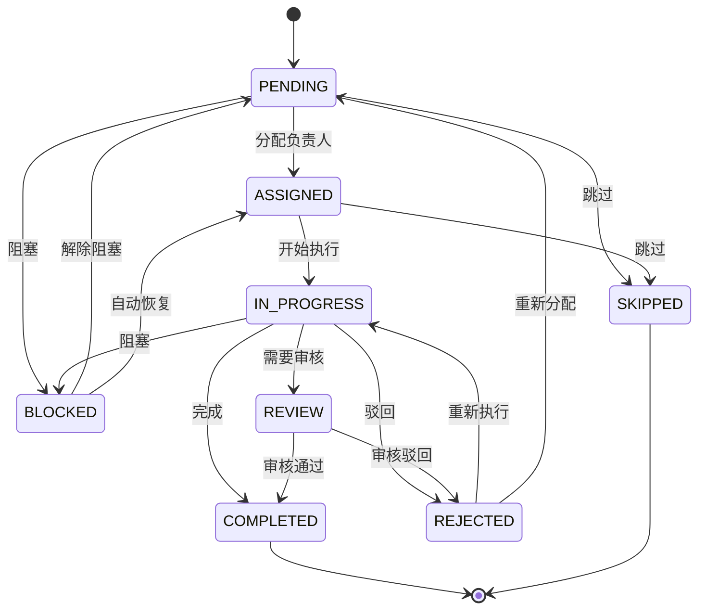

# 格物平台 — 工作流引擎设计文档

## 文档信息

| 项目 | 内容 |
|------|------|
| 文档名称 | 工作流引擎设计文档 |
| 版本 | V1.1 |
| 创建日期 | 2026-07-08 |
| 文档状态 | 初稿 |
| 关联统一文档 | 20-unified-prd.md, 21-unified-architecture.md, 22-unified-db-schema.md |
| 源设计文档 | opencode-1.17.14/docs/design/28-workflow-engine-design.md (V1.0) |
| 关联需求 | PRD V1.0 工作流模块 |
| 更新说明 | V1.1: 新增 §13.4 事件幂等性设计（含防重复消费策略和幂等伪代码） |

---

## 目录

1. [概述](#1-概述)
2. [架构设计](#2-架构设计)
3. [核心服务设计](#3-核心服务设计)
4. [状态机设计](#4-状态机设计)
5. [并行流程设计](#5-并行流程设计)
6. [超时处理设计](#6-超时处理设计)
7. [异常处理设计](#7-异常处理设计)
8. [通知服务设计](#8-通知服务设计)
9. [性能优化](#9-性能优化)
10. [监控设计](#10-监控设计)
11. [安全设计](#11-安全设计)
12. [部署设计](#12-部署设计)
13. [与统一文档的交叉引用](#13-与统一文档的交叉引用)
14. [总结](#14-总结)

---

## 1. 概述

### 1.1 设计目标

工作流引擎是格物平台的核心组件之一，用于支持**研发测试一体化流程**，实现需求→设计→开发→测试→安全→部署的全流程闭环管理。

**设计目标**：
- 支持串行和并行流程执行
- 支持流程节点的任务分配和审核
- 支持流程状态管理和流转控制
- 支持自动通知和超时提醒
- 支持流程回退和异常处理

### 1.2 设计原则

| 原则 | 说明 |
|------|------|
| **可配置** | 流程定义通过配置文件管理，支持动态调整 |
| **可扩展** | 支持自定义节点类型和流转规则 |
| **高可用** | 支持集群部署，故障自动恢复 |
| **高性能** | 支持高并发流程执行，响应时间 < 200ms |
| **可追溯** | 完整的流程日志和审计追踪 |

---

## 2. 架构设计

### 2.1 整体架构

```
┌─────────────────────────────────────────────────────────────────────────────┐
│                         工作流引擎整体架构                                    │
├─────────────────────────────────────────────────────────────────────────────┤
│                                                                             │
│  ┌─────────────────────────────────────────────────────────────────────┐   │
│  │                         接入层                                        │   │
│  │                                                                     │   │
│  │   ┌─────────────┐  ┌─────────────┐  ┌─────────────┐               │   │
│  │   │  REST API   │  │  WebSocket  │  │  RocketMQ   │               │   │
│  │   └─────────────┘  └─────────────┘  └─────────────┘               │   │
│  └─────────────────────────────────────────────────────────────────────┘   │
│                                    │                                        │
│       ┌────────────────────────────┼────────────────────────────┐          │
│       ▼                            ▼                            ▼          │
│  ┌─────────────┐          ┌─────────────┐          ┌─────────────┐        │
│  │  工作流     │          │  通知服务   │          │  监控服务   │        │
│  │  Engine     │          │  Service    │          │  Service    │        │
│  └─────────────┘          └─────────────┘          └─────────────┘        │
│       │                            │                            │          │
│       ▼                            ▼                            ▼          │
│  ┌─────────────┐          ┌─────────────┐          ┌─────────────┐        │
│  │  OceanBase  │          │  RocketMQ   │          │  Nightingale│        │
│  └─────────────┘          └─────────────┘          └─────────────┘        │
│                                                                             │
└─────────────────────────────────────────────────────────────────────────────┘
```

### 2.2 核心组件

| 组件 | 职责 | 依赖 |
|------|------|------|
| **WorkflowEngineService** | 工作流引擎核心服务 | WorkflowRepository, NotificationService |
| **WorkflowDefinitionService** | 工作流定义管理 | WorkflowRepository, WorkflowNodeRepository |
| **WorkflowInstanceService** | 工作流实例管理 | WorkflowInstanceRepository, WorkflowNodeInstanceRepository |
| **WorkflowNodeService** | 工作流节点管理 | WorkflowNodeInstanceRepository |
| **WorkflowNotificationService** | 工作流通知服务 | WorkflowNotificationRepository, RocketMQ |
| **WorkflowMonitorService** | 工作流监控服务 | WorkflowInstanceRepository, Nightingale |

### 2.3 数据流设计

```
┌─────────────────────────────────────────────────────────────────────────────┐
│                         工作流数据流                                          │
├─────────────────────────────────────────────────────────────────────────────┤
│                                                                             │
│  ┌─────────┐    ┌─────────┐    ┌─────────┐    ┌─────────┐    ┌─────────┐  │
│  │ 用户    │ ─→ │ API     │ ─→ │ Engine  │ ─→ │ DB      │ ─→ │ MQ      │  │
│  │ 操作    │    │ Gateway │    │ Service │    │ OceanBase│    │ RocketMQ│  │
│  └─────────┘    └─────────┘    └─────────┘    └─────────┘    └─────────┘  │
│                      │              │              │              │          │
│                      │              │              │              │          │
│                      ▼              ▼              ▼              ▼          │
│               ┌─────────────────────────────────────────────────────┐      │
│               │                    事件总线                          │      │
│               │                                                     │      │
│               │  WorkflowStarted → NodeAssigned → NodeCompleted     │      │
│               │  → ReviewRequired → WorkflowCompleted               │      │
│               └─────────────────────────────────────────────────────┘      │
│                                     │                                       │
│                                     ▼                                       │
│               ┌─────────────────────────────────────────────────────┐      │
│               │                    通知服务                          │      │
│               │                                                     │      │
│               │  系统通知 → 邮件通知 → 短信通知 → 企业微信通知        │      │
│               └─────────────────────────────────────────────────────┘      │
│                                                                             │
└─────────────────────────────────────────────────────────────────────────────┘
```

---

## 3. 核心服务设计

### 3.1 WorkflowEngineService

工作流引擎服务负责工作流实例的生命周期管理：

| 方法 | 说明 | 事务性 |
|------|------|--------|
| `startWorkflow(workflowId, entityType, entityId, userId)` | 启动工作流实例 | @Transactional |
| `completeNode(instanceId, nodeId, userId, output)` | 完成节点任务 | @Transactional |
| `reviewNode(instanceId, nodeId, userId, approved, comment)` | 审核节点任务 | @Transactional |
| `rollbackNode(instanceId, nodeId, userId, reason)` | 回退到前置节点 | @Transactional |
| `pauseWorkflow(instanceId, userId)` | 暂停工作流 | @Transactional |
| `resumeWorkflow(instanceId, userId)` | 恢复工作流 | @Transactional |
| `cancelWorkflow(instanceId, userId, reason)` | 取消工作流 | @Transactional |

**启动工作流流程**：
1. 加载工作流定义
2. 创建工作流实例（状态：RUNNING）
3. 初始化第一个节点（状态：PENDING）
4. 更新当前节点
5. 发送启动通知
6. 发布 WorkflowStarted 事件到 RocketMQ

**完成节点流程**：
1. 验证节点状态
2. 更新节点状态为 COMPLETED
3. 记录流转日志
4. 获取下一个节点 → 激活或完成工作流
5. 发送完成通知
6. 发布 NodeCompleted 事件

### 3.2 WorkflowDefinitionService

工作流定义服务负责工作流模板的 CRUD 操作：

| 方法 | 说明 |
|------|------|
| `createWorkflow(dto, userId)` | 创建工作流定义（含节点定义） |
| `updateWorkflow(workflowId, dto, userId)` | 更新工作流定义 |
| `activateWorkflow(workflowId, userId)` | 激活工作流定义（验证完整性） |
| `getWorkflow(workflowId)` | 获取工作流定义 |
| `listWorkflows(query, pageable)` | 分页查询工作流定义 |

### 3.3 通知服务

通知服务通过 RocketMQ 异步发送，支持多渠道：

| 通知类型 | 触发时机 | 接收方 |
|----------|----------|--------|
| TASK_CREATED | 工作流启动 | 创建者 |
| TASK_ASSIGNED | 节点分配 | 分配的用户 |
| REVIEW_REQUIRED | 需要审核 | 审核人 |
| TIMEOUT_WARNING | 节点超时 | 负责人 |
| TASK_COMPLETED | 节点完成 | 创建者 |
| WORKFLOW_COMPLETED | 工作流完成 | 创建者 |
| WORKFLOW_CANCELLED | 工作流取消 | 创建者 |

---

## 4. 状态机设计

### 4.1 工作流状态



| 当前状态 | 可转换状态 |
|----------|-----------|
| PENDING | RUNNING, CANCELLED |
| RUNNING | PAUSED, COMPLETED, FAILED, CANCELLED |
| PAUSED | RUNNING, CANCELLED |
| COMPLETED | — (终态) |
| FAILED | RUNNING, CANCELLED |
| CANCELLED | — (终态) |

### 4.2 节点状态



| 节点类型 | 说明 | 示例 |
|----------|------|------|
| TASK | 普通任务节点 | 需求收集、编码开发 |
| REVIEW | 审核节点 | 需求评审、代码审查 |
| APPROVAL | 审批节点 | 部署审批 |
| AUTOMATION | 自动化节点 | 自动化测试、安全扫描 |
| GATEWAY | 网关节点 | 并行分支、条件判断 |

---

## 5. 并行流程设计

### 5.1 并行执行机制

```java
@Service
public class ParallelFlowHandler {
    
    /**
     * 启动并行分支
     */
    public void startParallelBranches(Long instanceId, List<String> branchNodeIds)
    
    /**
     * 检查所有并行分支是否全部完成
     */
    public boolean areAllBranchesCompleted(Long instanceId, List<String> branchNodeIds)
    
    /**
     * 同步并行分支（全部完成后激活下一个节点）
     */
    @Transactional
    public void syncParallelBranches(Long instanceId, List<String> branchNodeIds, String nextNodeId)
}
```

### 5.2 并行同步配置示例

```yaml
workflow:
  name: "研发测试一体化流程"
  phases:
    - name: "设计阶段"
      type: "parallel"
      branches:
        - name: "开发设计分支"
          nodes:
            - id: "high_level_design"
            - id: "detailed_design"
            - id: "design_review"
            - id: "design_confirm"
        - name: "测试设计分支"
          nodes:
            - id: "test_plan"
            - id: "testcase_design"
            - id: "testcase_review"
            - id: "testcase_confirm"
      sync:
        strategy: "ALL_COMPLETE"
        next_node: "development_phase"
```

---

## 6. 超时处理设计

### 6.1 超时检测

定时任务每 5 分钟检测超时节点：

```java
@Scheduled(fixedRate = 300000) // 每 5 分钟
public void checkTimeoutNodes() {
    // 查询超时节点
    // 发送超时提醒通知
    // 更新节点状态为 BLOCKED
    // 发布超时事件到 RocketMQ
}
```

### 6.2 超时配置

```yaml
workflow:
  timeout:
    default_hours: 48  # 默认超时时间
    node_timeouts:
      - node_id: "requirement_review"
        timeout_hours: 24
      - node_id: "design_review"
        timeout_hours: 24
      - node_id: "code_review"
        timeout_hours: 16
    handling:
      first_warning_hours: 4  # 超时前 4 小时首次提醒
      second_warning_hours: 2  # 超时前 2 小时再次提醒
      auto_escalate_hours: 0  # 超时后自动升级
```

---

## 7. 异常处理设计

### 7.1 异常类型

| 异常类型 | 说明 | 处理策略 |
|----------|------|----------|
| WORKFLOW_NOT_FOUND | 工作流不存在 | 返回 404 |
| NODE_NOT_FOUND | 节点不存在 | 返回 404 |
| INVALID_TRANSITION | 无效的状态转换 | 返回 400 |
| PERMISSION_DENIED | 权限不足 | 返回 403 |
| TIMEOUT | 节点超时 | 发送通知，阻塞节点 |
| DEPENDENCY_NOT_MET | 依赖未满足 | 阻塞节点 |
| RESOURCE_UNAVAILABLE | 资源不可用 | 暂停工作流 |
| CONFLICT | 数据冲突 | 发送冲突通知 |

### 7.2 异常处理策略

| 异常场景 | 处理方式 | 通知对象 |
|----------|----------|----------|
| 超时异常 | 发送超时提醒，阻塞节点 | 负责人 |
| 依赖未满足 | 阻塞当前节点 | 创建者 |
| 资源不可用 | 暂停工作流 | 运维工程师 |
| 数据冲突 | 发送冲突通知 | 操作者 |

---

## 8. 通知服务设计

### 8.1 通知渠道

| 渠道 | 实现方式 | 优先级 |
|------|----------|--------|
| 站内通知 | 数据库存储 + SSE 推送 | P0 |
| 邮件通知 | JavaMailSender | P1 |
| 企业微信通知 | 企业微信机器人 API | P1 |
| 短信通知 | 短信网关 | P2 |

### 8.2 通知数据结构

```sql
CREATE TABLE workflow_notification (
    id BIGINT PRIMARY KEY AUTO_INCREMENT,
    instance_id BIGINT NOT NULL,
    node_instance_id BIGINT,
    type VARCHAR(50) NOT NULL,
    recipient_id BIGINT NOT NULL,
    title VARCHAR(200) NOT NULL,
    content TEXT,
    is_read TINYINT DEFAULT 0,
    sent_at TIMESTAMP DEFAULT CURRENT_TIMESTAMP,
    INDEX idx_recipient_read (recipient_id, is_read),
    INDEX idx_type_sent (type, sent_at)
);
```

---

## 9. 性能优化

### 9.1 缓存策略

| 缓存对象 | 缓存策略 | TTL | 说明 |
|----------|----------|-----|------|
| 工作流定义 | Cache-Aside | 10 分钟 | Redis (龙缓) |
| 节点定义 | Cache-Aside | 10 分钟 | Redis (龙缓) |
| 用户权限 | Cache-Aside | 5 分钟 | Redis (龙缓) |

### 9.2 数据库优化

```sql
-- 工作流实例表索引
CREATE INDEX idx_workflow_instances_status_created ON workflow_instances(status, created_at);
CREATE INDEX idx_workflow_instances_entity_status ON workflow_instances(entity_type, entity_id, status);

-- 工作流节点实例表索引
CREATE INDEX idx_workflow_node_instances_instance_status ON workflow_node_instances(instance_id, status);
CREATE INDEX idx_workflow_node_instances_assigned_status ON workflow_node_instances(assigned_to, status);
```

---

## 10. 监控设计

### 10.1 监控指标

| 指标名称 | 类型 | 说明 | 阈值 |
|----------|------|------|------|
| `workflow_instance_count` | gauge | 工作流实例总数 | — |
| `workflow_instance_running` | gauge | 运行中工作流实例数 | < 100 |
| `workflow_instance_completed` | gauge | 已完成工作流实例数 | — |
| `workflow_instance_failed` | gauge | 失败的工作流实例数 | < 5 |
| `workflow_node_timeout` | gauge | 超时的节点数 | < 10 |
| `workflow_api_response_time` | histogram | API 响应时间 (P95) | < 200ms |

### 10.2 告警规则

| 告警名称 | 规则 | 严重级别 |
|----------|------|----------|
| 运行中实例过多 | `workflow_instance_running > 100` 持续 5 分钟 | warning |
| 失败实例过多 | `workflow_instance_failed > 5` 持续 3 分钟 | critical |
| 节点超时过多 | `workflow_node_timeout > 10` 持续 5 分钟 | warning |
| API 响应延迟 | `workflow_api_response_time P95 > 500ms` 持续 5 分钟 | warning |

---

## 11. 安全设计

### 11.1 权限控制

| 节点类型 | 执行角色 | 审核角色 |
|----------|----------|----------|
| 需求收集 | 产品经理 | — |
| 需求评审 | — | 技术负责人 |
| 设计 | 架构师 | — |
| 设计评审 | — | 技术负责人 |
| 开发 | 开发工程师 | — |
| 代码审查 | — | 架构师/技术负责人 |
| 测试 | 测试工程师 | — |
| 测试评审 | — | QA 经理 |
| 安全扫描 | 安全工程师 | — |
| 部署审批 | — | 技术负责人 |

### 11.2 审计日志

所有工作流操作通过 AOP 切面记录审计日志：

| 审计字段 | 说明 |
|----------|------|
| workflow_id | 工作流定义 ID |
| instance_id | 工作流实例 ID |
| node_id | 节点 ID |
| operation | 操作类型（START, COMPLETE, REVIEW, REJECT, CANCEL, TIMEOUT） |
| operator_id | 操作人 |
| before_state | 操作前状态 |
| after_state | 操作后状态 |
| ip_address | 客户端 IP |
| response_time | 响应时间 (ms) |

---

## 12. 部署设计

### 12.1 部署架构

```
┌─────────────────────────────────────────────────────────────────────────────┐
│                         工作流引擎部署架构                                    │
├─────────────────────────────────────────────────────────────────────────────┤
│                                                                             │
│  ┌─────────────────────────────────────────────────────────────────────┐   │
│  │                         负载均衡层 (SLB/Nginx)                        │   │
│  └─────────────────────────────────────────────────────────────────────┘   │
│                                    │                                        │
│       ┌────────────────────────────┼────────────────────────────┐          │
│       ▼                            ▼                            ▼          │
│  ┌─────────────┐          ┌─────────────┐          ┌─────────────┐        │
│  │  Workflow   │          │  Workflow   │          │  Workflow   │        │
│  │  Engine 1   │          │  Engine 2   │          │  Engine 3   │        │
│  └─────────────┘          └─────────────┘          └─────────────┘        │
│       │                            │                            │          │
│       └────────────────────────────┼────────────────────────────┘          │
│                                    ▼                                        │
│  ┌─────────────────────────────────────────────────────────────────────┐   │
│  │                         数据层                                        │   │
│  │   OceanBase (主从)  │  RocketMQ (集群)  │  龙缓 (集群)               │   │
│  └─────────────────────────────────────────────────────────────────────┘   │
│                                                                             │
└─────────────────────────────────────────────────────────────────────────────┘
```

### 12.2 配置示例

```yaml
# application-workflow.yml
workflow:
  engine:
    thread-pool:
      core-size: 10
      max-size: 50
      queue-capacity: 1000
    timeout:
      check-interval: 300000  # 5 分钟
      default-hours: 48
    notification:
      enabled: true
      channels:
        - system
        - email
  cache:
    enabled: true
    ttl: 600  # 10 分钟
  monitoring:
    enabled: true
    metrics-port: 9090
```

---

## 13. 与统一文档的交叉引用

### 13.1 PRD 对应关系

| PRD 用户故事 | 工作流设计对应章节 | 说明 |
|-------------|-------------------|------|
| US-WF-01（工作流模板定义） | §3.2 WorkflowDefinitionService | 模板 CRUD + 节点定义 |
| US-WF-02（发起工作流实例） | §3.1 WorkflowEngineService.startWorkflow | 实例生命周期 |
| US-WF-03（待办任务通知） | §8 通知服务 | RocketMQ 多渠道通知 |
| US-WF-04（可视化设计器） | — (Phase 2) | 拖拽式 UI 设计器 |
| US-WF-05（执行监控） | §10 监控设计 | 指标 + 告警 |

### 13.2 数据库对应关系

| 数据库表 | 工作流设计对应章节 | 说明 |
|---------|-------------------|------|
| workflow（定义） | §3.2 定义服务 | 工作流模板 |
| workflow_node（节点） | §3.2 定义服务 | 节点定义 |
| workflow_transition（流转） | §4 状态机 | 状态转换记录 |
| workflow_instance（实例） | §3.1 引擎服务 | 运行实例 |
| workflow_node_instance（节点实例） | §3.1 引擎服务 | 节点运行实例 |
| workflow_notification（通知） | §8 通知服务 | 通知记录 |

### 13.3 安全对应关系

| 安全文档章节 | 工作流设计对应章节 | 说明 |
|-------------|-------------------|------|
| 24-unified-security.md §9.1 工作流权限 | §11.1 权限控制 | 节点级权限 |
| 24-unified-security.md §9.2 工作流审计 | §11.2 审计日志 | 操作审计追踪 |

### 13.4 事件幂等性设计

工作流引擎在分布式场景下可能重复投递事件（RocketMQ 重试、网络抖动、消费者重启等）。所有事件处理器必须保证幂等性。

#### 幂等性策略总览

| 事件类型 | 幂等键 | 保护机制 | 说明 |
|---------|--------|---------|------|
| `WorkflowCreated` | workflow_id | DB 唯一约束 | 创建时若已存在则跳过 |
| `WorkflowStarted` | workflow_instance_id | 状态机 + DB 唯一约束 | 状态 ≠ CREATED 时拒绝启动 |
| `NodeStarted` | node_instance_id | 状态机 + DB 唯一约束 | 状态 ≠ PENDING 时拒绝启动 |
| `NodeCompleted` | node_instance_id | 状态机 + DB 唯一约束 | 状态 ≠ RUNNING 时拒绝完成 |
| `NodeFailed` | node_instance_id | 状态机 + DB 唯一约束 | 状态 ≠ RUNNING 时拒绝失败 |
| `NotificationCreated` | notification_id | DB 唯一约束 | 通知去重 |
| `PermissionChanged` | permission_id + matrix_id | DB 唯一约束 | 权限矩阵去重 |

#### 事件幂等性伪代码

```java
@Service
public class WorkflowEventProcessor {

    private final WorkflowInstanceMapper instanceMapper;

    @RocketMQMessageListener(topic = "workflow-events")
    public void onNodeCompleted(NodeCompletedEvent event) {
        // 1. 幂等检查：原子状态转换
        int affected = instanceMapper.atomicUpdateStatus(
            event.getNodeInstanceId(),
            NodeStatus.RUNNING,      // expected current status
            NodeStatus.COMPLETED     // target status
        );
        if (affected == 0) {
            log.warn("Node {} already completed or not in RUNNING, skip", 
                     event.getNodeInstanceId());
            return;
        }
        // 2. 执行业务逻辑
        triggerNextNodes(event);
    }
}

// OceanBase/MySQL 原子更新
UPDATE workflow_node_instance
SET status = ?, completed_at = ?, result = ?
WHERE id = ? AND status = ?
-- 如果 affected_rows = 0 → 幂等成功（已处理过）
```

#### 防重复消费措施

| 层级 | 机制 | 实现 |
|------|------|------|
| **应用层** | 状态机原子更新 | `UPDATE ... WHERE status = expected` |
| **数据库层** | 唯一约束 | `uk_instance_session (instance_id, session_id)` |
| **消息层** | RocketMQ 消费幂等 | 消费者本地 + 分布式锁 |
| **请求层** | UUID 请求去重 | API Gateway 层 `X-Request-Id` + Redis SETNX |

#### 事件幂等性表设计增强

```sql
-- workflow_instance 表新增幂等控制字段
ALTER TABLE workflow_instance
    ADD COLUMN last_event_id VARCHAR(64) COMMENT '最近处理的事件ID(防重)' AFTER status;

CREATE UNIQUE INDEX uk_instance_last_event ON workflow_instance (id, last_event_id);
```

---

## 14. 总结

### 14.1 设计要点

1. **架构清晰**：采用分层架构，职责分明
2. **状态机**：完整的工作流（6 状态）和节点（8 状态）状态机
3. **并行支持**：支持并行分支和同步机制
4. **超时处理**：定时检测和自动处理超时节点
5. **异常处理**：完善的异常处理策略
6. **性能优化**：缓存、数据库索引等优化措施
7. **监控告警**：完善的监控和告警机制
8. **安全设计**：节点级权限控制和完整审计追踪

### 14.2 技术选型

| 组件 | 技术选型 | 说明 |
|------|----------|------|
| 工作流引擎 | 自研 | 满足定制化需求 |
| 数据库 | OceanBase / 达梦 / 人大金仓 | 信创合规数据库 |
| 缓存 | 龙缓 / DragonflyDB | Redis 兼容 |
| 消息队列 | RocketMQ | 高吞吐异步通知 |
| 监控 | Nightingale | 国产监控系统 |

### 14.3 后续优化

1. **可视化流程设计器**：支持拖拽式流程设计（Phase 2）
2. **流程版本管理**：支持流程定义的版本管理
3. **流程分析**：支持流程执行数据分析
4. **AI 辅助**：支持 AI 辅助流程优化建议
